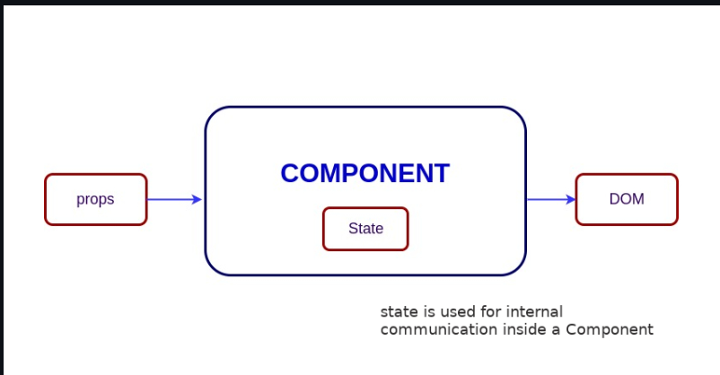

# React

### React 主要特点：

- 使用 JSX 语法(JS 的语法扩展)，允许开发人员在其 JS 代码中编写 HTML；
- 使用虚拟 DOM 而不是真实 DOM(真实 DOM 操作成本高昂)；
- 支持服务器渲染，对搜索引擎优化(SEO)很有用；
- 遵循单向或单向数据流或数据绑定；
- 使用可重用/可组合的 UI 组件来开发视图。

### 什么是 JSX

jsx 代表 JavaScript XML，为函数提供语法糖。`React.createElement(type, props, ...children)`

- JSX 比 HTML 更加严格

```js
export default function App() {
  return <h1 className="greeting">{"Hello, this is a JSX Code"}</h1>;
}
// 不使用JSX语法糖
import { createElement } from 'react';
export default function App() {
    return createElement(
        'h1',
        { className: 'greeting' },
        'Hello, this is a JSX Code!'
    );
}
// 查看类
class App extends React.Component {
    render() {
        return (
            <h1 className="greeting">{"Hello, this is a JSX Code!"}</h1>
        )
    }
}
```

### 元素和组件的区别

元素是一个普通对象，用于描述希望在屏幕上显示的 DOM 节点或其他组件的内容。元素可以在其属性中包含其他元素。创建一个 React 元素的开销很小。一旦元素被创建，就不能被修改。

```js
// 不使用JSX
const element = React.createElement("div", { id: "login-btn"}, "login")
// 使用JSX
<div id="login-btn"></div>

// 上述函数返回一个对象，`React.createElement()`
{
    type: 'div',
    props: {
        children: 'Login',
        id: 'login-btn'
    }
}  //最后此元素使用 `ReactDOM.render()`

// 一个组件可以通过几种不同的方式声明。可以是带有方法的类，也可以定义为函数。无论哪种情况都以props作为输入，并返回一个JSX树作为输出：`render()`
const Button = ({ handleLogin })=>(
    <div id={"login-btn"} onClick={handleLogin}>
        Login
    </div>
)
// 然后JSX被转译为函数树：`React.createElement()`
const Button = ({ handleLogin }) =>{
    React.createElement(
        "div",
        { id: "login-btn", onClick: handleLogin},
        "Login"
    )
}
```

### 如何在 React 中创建组件

(1) 功能组件：
`` javascript
function Greeting({message}) {
    return <h1>{`Hello, ${message}`}</h1>
}
 ``
(2) 类组件

```js
class Greeting extends React.Component {
  render() {
    return <h1>{`Hello, ${this.props.message}`}</h1>;
  }
}
```

### 何时使用类组件而不是函数组件

建议在 React 中使用 Function 组件而不是 class 组件。因为可以使用状态、生命周期方法和其他仅在函数组件中存在的类组件中可用的功能。
使用类组件的原因：

- 需要一个 React 功能，其 Function 组件等效项尚不存在，比如 Error Boundaries
- 在旧版本中，如果组件需要状态或生命周期方法，则需要使用类组件。

**总结：**

**_使用功能组件_**

- 不需要状态或生命周期方法，并且组件纯粹是表达式。
- 为了简单、可读性和现代代码实践，特别是使用 React Hooks 来处理状态和副作用。

**_使用类组件_**

- 如果需要管理状态或使用生命周期方法
- 在需要向后兼容或与旧代码集成的情况下。

### 什么是纯组件

对于相同的状态和属性(state 和 props)，总是渲染相同输出的组件。
在函数组件中，可以通过将组件包裹在 memoized API 来实现纯组件。这个 API 通过浅层比较来比较前后的 props，从而防止不必要的重新渲染。因此对于性能优化很有用。
纯组件不会比较之前的 state 和当前的 state，因为函数组件本身在设置相同的 state 时默认就会防止不必要的渲染。
memoized 组件爱你语法表示：

```js
const MemoizedComponent = memo(SomeComponent, arePropsEqual?);
// 举例：
import React from 'react';
const MyComponent = (props)=>{
    // 组件逻辑和JSX
    return <div>{props.value}</div>
}
export default React.memo(MyComponent)
```

### React 中的状态是什么？

组件的状态是一个对象，每当状态发生变化，组件都会重新渲染。组件的状态是私有的，完全由组件控制。其他任何组件都无法访问它。


```js
import { useState } from "react";
function User() {
  const [message, setMessage] = useState("welcome to React world");
  return (
    <div>
      <h1>{message}</h1>
    </div>
  );
}
// =========
import React from "react";
class User extends React.Component {
  construtor(props) {
    super(props);
    this.state = {
      message: "welcome to React world",
    };
  }
  render() {
    return (
      <div>
        <h1>{this.state.message}</h1>
      </div>
    );
  }
}
```

### React 中的 props

props 是组件的输入。是传递给组件的单个值或包含一组值的对象，类似于 HTML 标签的属性。数据从父组件传递到子组件。
props 用途：

- 将自定义数据传递给组件；
- 触发状态变化；
- 在组件的方法中使用。如 `this.props.reactProp`以及`render()`方法

```js
// 函数组件中props用法
import React from "react";
import ReactDOM from "react-dom";
const ChildComponent = (props) => {
  return (
    <div>
      <p>{props.name}</p>
      <p>{props.age}</p>
      <p>{props.gender}</p>
    </div>
  );
};
const ParentComponent = () => {
  return (
    <div>
      <ChildComponent name="John" age="30" gender="male" />
      <ChildComponent name="Mary" age="24" gender="female" />
    </div>
  );
};
// ES6方法直接访问props对象中的属性。简化：
const ChildComponent = ({ name, age, gender = "male" }) => {
  return (
    <div>
      <p>{name}</p>
      <p>{age}</p>
      <p>{gender}</p>
    </div>
  );
};
```

### React 中的 state 和 props 有什么区别

在 React 中，state 和 props 都是普通的 JavaScript 对象，用于管理组件的数据，但它们使用方式和特性不同。

- state 由组件自身管理，并可以通过 setter 函数(类组件中使用`setState`)进行更新。与 props 不同，state 可以由组件自身修改，用于管理组件的内部状态。state 的变化会触发组件以及子组件的重新渲染。仅使用 state，组件无法实现可重用性。
- props 父组件传递数据给子组件，只读，不能被组件自身修改。props 可以用于配置组件的行为，并在组件之间传递数据。通过使用 props，组件可以实现可重用性。

### HTML 和 React 事件处理有什么区别

- (1) HTML 中，事件名称通常以小写形式表示。React 中则遵循 驼峰命名 约定

```js
// HTML:
<button onclick="activateLasers()"></button>
// React:
<button onclick={activateLasers}>
```

- (2) 在 HTML 中，可以通过返回`false`来防止默认行为。在 React 中，必须显式调用：`preventDefault()`

```js
// HTML:
<a href="#" onclick='console.log("The link was clicked."); return false;' />;
// React:
function handleClick(event) {
  event.preventDefault();
  console.log("The link was clicked.");
}
```

- (3) 在 HTML 中，需要通过追加函数名称来调用函数。在 React 中，不应该追加函数名称。

### React 中的 SyntheticEvent

<p> SyntheticEvent 是对浏览器原生事件的跨浏览器包装器。它的 API 与浏览器的原生事件相同，包括事件属性和方法，但是 SyntheticEvent 可以在所有浏览器中以相同的方式工作。可以通过`nativeEvent`属性直接访问底层的原生事件。</p>

```js
// BookStore标题搜索组件为例，该组件可以获取所有原生事件属性的功能
function BookStore() {
    handleTitleChange(e) {
        console.log('The new title is:', e.target.value);
        const nativeEvent = e.nativeEvent;
        console.log(nativeEvent);
        e.stopPropogation();
        e.preventDefault();
    }
    return <input name="title" onChange={handleTitleChange} />
}
```

### 什么是内联条件表达式？

<p> 内联条件表达式指在 JSX 中使用 JavaScript 的条件语句或三元表达式来条件性地渲染表达式。除了这些方法外，还可以通过将表达式用花括号包裹起来，然后使用 JavaScript 的逻辑与运算符`&&`在 JSX 中嵌入任何表达式。</p>

```js
<h1>Hello!</h1>;
{
  message.length > 0 && !isLogin ? (
    <h2>You have {message.length} unread message.</h2>
  ) : (
    <h2>You don't have unread messages.</h2>
  );
}
```

### 什么是`key`属性及其在元素数组中的使用优势？

<p>key是一个特殊属性，当遍历数组来渲染数据时，应该包括它。key属性帮助 React 标识哪些项目发生了变化、被添加或被移除。</p>
<p> key 在同级元素中应该是唯一的，通常使用数据 ID 作为key。</p>    
   
```js
const todoItem = todos.map((todo) => <li key={todo.id}>{todo.text}</li>);
// 没有id可使用索引
const todoItems = todos.map((todo, index) => {
  <li key={index}>{todo.text}</li>;
});
```

### 什么是虚拟 DOM

虚拟 DOM 是真实 DOM 的内存表示。描述了 DOM 树的结构及属性。

  <p> 工作原理： - 当组件的状态或属性发生变化时，React 首先在内存中创建一个新的虚拟 DOM 树；然后 React 会将新的虚拟 DOM 树与之前的虚拟 DOM 树进行比较，找出需要更新的部分；找出需要更新的部分后，React 将这些变化批量更新到真实 DOM 中。</p>

优势：
======待回答========================

1. Shadow DOM 和 Virtual DOM 的区别
   ============待回答==========

### 什么是 React Fiber？

    Fiber 是为了提高在以下方面的适用性：

    - 动画：更好地支持复杂的动画效果；
    - 布局：优化布局计算和渲染；
    - 手势：改进对用户手势的处理；
    - 暂停和中止：能够在必要时暂停或中止渲染工作；
    - 重用工作：提高渲染任务的可重用性；
    - 更新优先级：可以为不同类型的更新分配优先级；
    - 新的并发原语：引入新的并发处理机制，以更高效地管理渲染任务。

### 什么是受控组件？

<p>
    指在表单中控制输入元素的组件，即每次状态变化都会有一个关联的处理函数。意味着显示的数据始终与组件的状态保持同步。
实现受控组件的步骤：
</p>

1. 初始化状态：在函数组件中使用`useState`钩子，或在类组件的构造函数中初始化状态。
2. 设置表单元素的值：将表单元素的值设置为相应的状态变量。
3. 创建事件处理函数：创建一个事件处理函数，通过`useState`更新函数或类组件的`setState`方法来处理用户输入的变化。
4. 将事件处理函数附加到表单元素的事件：将上述事件处理附加到表单元素的`change`或`click`事件上。

```js
import React, { useState } from "react";
function UserProfile() {
  const [username, setUsername] = useState("");
  const handleChange = (e) => {
    setUsername(e.target.value);
  };
  return (
    <form>
      <label>
        Name:
        <input type="text" value={username} onChange={handleChange} />
      </label>
    </form>
  );
}
```

### 什么是不受控组件

<p>不受控组件是在内部存储自己的状态的组件，可以在需要时使用 ref 查询 DOM 以查找其当前值。更像是传统的 HTML。不受控组件实现：</p>

1. 在函数组件或函数组件中使用 useRef react hook 创建 ref。`React.createRef()`
2. 将此引用附加到表单元素
3. 表单元素值可以通过事件处理程序或类组件直接访问`ref` `componentDidMount  `

```js
// UserProfile组件中使用ref.username
import React, { useRef } from "react";
function UserProfile() {
  const usernameRef = useRef(null);
  const handleSubmit = (event) => {
    event.preventDefault();
    console.log("提交的username是：" + usernameRef.current.value);
  };
  return (
    <form onSubmit={handleSubmit}>
      <label>
        Username:
        <input type="text" ref={usernameRef} />
      </label>
      <button type="submit">提交</button>
    </form>
  );
}
```

### React.Children.map、React.cloneElement、React.createElement、React.Children.toArray

- `React.Children.map`：用于遍历 React 组件的子元素。有两个参数：第一个参数是组件的子元素 prop，第二个参数是一个函数，将被调用，并以每个子元素作为参数。该函数应该返回一个修改后的子元素版本，将用于新数组中由 map 方法返回的结果。
- `React.cloneElement`：用于克隆并返回一个新的 React 元素，同时可以为该元素指定新的 props。接收两个参数：第一个参数是要克隆的 React 元素，第二个参数是一个可选的对象，用于指定新的 props。克隆后的元素将保留原始的 key 和 ref，同时也继承了新的 props。该方法通常用于在不改变原始元素的情况下，修改元素的 props 或增加新的 props。
- `React.createElement`：用于创建并返回一个新的虚拟 DOM 元素。接受三个参数：元素的类型（可以是表示 HTML 标签的字符串或表示 React 组件的函数）、包含要分配给元素的任何属性的对象，以及元素的任何子元素。通常在 JSX 中使用此函数来创建和渲染 React 组件。
- `React.Children.toArray`：用于将 props.children 转换为一个扁平的数组。接收一个 props.children 作为参数，并返回一个数组，其中包含所有的子元素（包括字符串、数字、元素或者数组）

  **注意：** 有时候直接对 props.children 进行操作，可能会出现一些问题：

  - 当 props.children 只有一个子元素时，它的类型不是数组，而是一个单独的 React 元素。如果直接对它进行数组操作，会导致类型错误。此外，当 props.children 没有子元素时，值为 null，而不是一个空数组。这可能导致类型错误或其他问题。
  - 当 props.children 包含嵌套的子元素时，如果不对它进行递归处理，可能会无法访问到所有的子元素，或无法正确处理子元素的嵌套结构。因此，为了避免这些问题，建议在对 props.children 进行操作之前，先使用 React.Children.toArray 将其转换为一个扁平的数组，这样可以方便地遍历和处理所有的子元素，无论它们的类型和数量。

### 什么是 React 中的状态提升

<p>当多个组件爱你需要共享相同的更改数据时，建议将共享状态提升到其最接近的共同祖先。这意味着，如果两个子组件共享来自其父组件的相同数据，则将状态移动到父组件，而不是在两个子组件中维护本地状态。</p>

### useEffect 钩子的工作原理是什么

1. 调度副作用：当在组件内部调用 useEffect 时，实际上是将一个副作用函数及其依赖项数组排队等待执行。这个函数不会立即执行。
2. 提交阶段：React 渲染组件并执行了所有的纯函数组件或类组件的渲染方法后，会进入提交阶段。在这个阶段，React 将计算出的新视图(新的 DOM 节点)更新到屏幕上。一旦这个更新完成，React 就知道现在可以安全地执行副作用函数了，因为这不会影响到正在屏幕上显示的界面。
3. 副作用执行：提交阶段完成后，React 会处理所有排队的副作用。如果组件是首次渲染，所有的副作用都会执行。如果组件是重新渲染，React 会首先对比副作用的依赖项数组；如果依赖项未变，副作用则不会执行；如果依赖项有变化，或没有提供依赖项数组，副作用会再次执行。
4. 清理机制“如果副作用函数返回来一个函数，那么这个函数将被视为清理函数。在执行当前的副作用之前，以及组件卸载前，React 会先调用上一次渲染中的清理函数。这样确保了不会有内存泄漏，同时能撤销上一次副作用导致的改变。
5. 延迟副作用：尽管 useEffect 会在渲染之后执行，但是异步执行的，不会阻塞浏览器更新屏幕。意味着 React 会等待浏览器完成绘制之后，再执行你的副作用函数，以此来确保副作用处理不会导致用户可见的延迟。
   通过这种机制，useEffect 允许开发者以一种优化的方式来处理组件中可能存在的副作用，而不需要关心渲染的具体时机。退出清理功能确保了即使组件被多次快速创建和销毁，应用程序也能保持稳定和性能。
