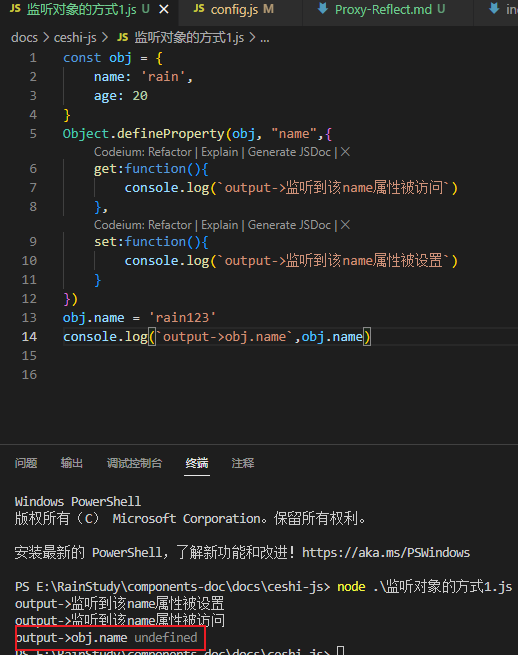
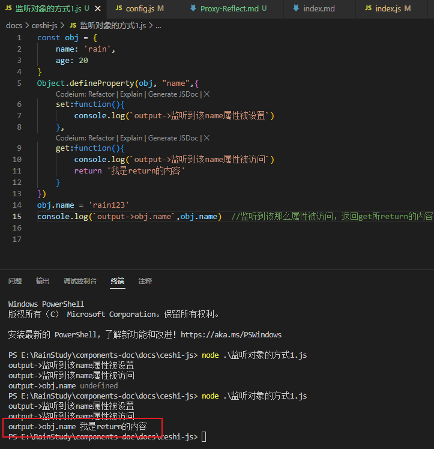
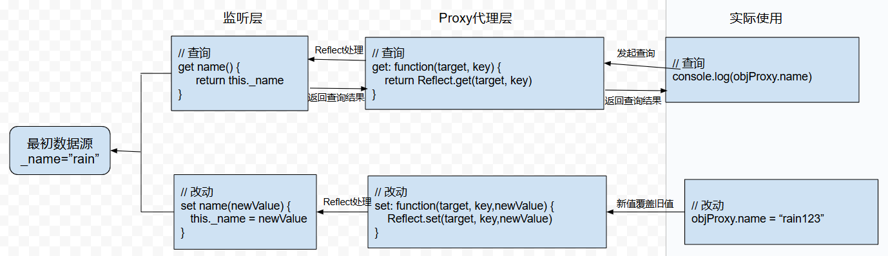
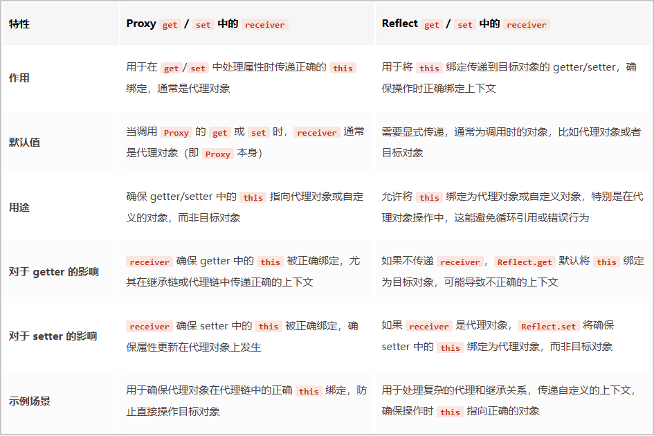

# Proxy 与 Reflect

## 前言

### 一、监听对象的操作



<div class="tiwen">
<div>通过上面的演示可以看到，不管是查看属性还是设置属性，都能被 get 与 set 所捕获。</div>
<div>但是存在问题：监听到属性，没有返回正确的 name 属性，而是 undefined。</div>
<div>这是因为查看属性会触发get,而get没有返回内容，相当于return了一个undefined。</div>
</div>



<div class="tiwen">
<div>通过get监听案例可知：若想要返回正确的value值，只需要拿到监听的key，然后从对象中针对性获取即可，同时处理 当改变值时，在set中新值覆盖旧值就行。</div>
<div>由此得出思路：监听对象的全部属性，首先需要获取全部的key属性，然后遍历key属性填入defineProperty方法中，实现监听全部属性。</div>
</div>

<div class="code-title">代码示例：</div>

```js
const obj = {
  name: "rain",
  age: 20,
  Hobbies: "学习JS",
};
Object.keys(obj).forEach((key) => {
  let value = obj[key];
  Object.defineProperty(obj, key, {
    set: function (newValue) {
      console.log(`output->监听到${key}属性被设置值`);
      value = newValue;
    },
    get: function () {
      console.log(`监听到${key}属性`);
      return value;
    },
  });
});

obj.name = "rain123";
obj.age = 22;
obj.Hobbies = "dancing";
console.log(`output->obj.name`, obj.name); //监听到该那么属性被访问，返回 get 所 return 的内容
```

- 通过遍历对象的全部属性，解决单独使用 defineProperty 方法只能监听单一属性的弊端。
- 但是, 如果想监听更加丰富的操作，如 新增属性、删除属性，`Object.defineProperty`是无能为力的。

### 二、Proxy 基本使用

<div class="tip-box">
<div>在ES6中，新增Proxy类，用于帮助我们创建一个代理。</div>
<div>如果希望监听一个对象的相关操作，那么可以 先创建一个代理对象(Proxy对象)，之后对该对象的所有操作，都通过 代理对象来完成，代理对象 可以监听我们想要对 原对象进行的那些操作。
</div>
</div>

<div class="code-title">代码示例：</div>

```js
const obj = {
  name: "rain",
  age: 20,
  Hobbies: "学习JS",
};

// 1. 创建一个Proxy对象，Proxy对象是一个类，所以使用new创建
const objProxy = new Proxy(obj, {
  //代理obj
  set: function (target, key, value) {
    // target:侦听对象，key: 侦听对象的key，value: 修改的新值
    console.log(`output->监听：${key} 的设置值`);
    target[key] = value;
  },
  get: function (target, key) {
    console.log(`output->监听：${key} 的获取`);
    return target[key];
  },
  deleteProperty: function (target, key) {
    console.log(`output->监听删除${key} 属性`);
    delete target[key];
  },
  has: function (target, key) {
    console.log(`output->监听in判断${key} 属性`);
    return key in target;
  },
});

delete objProxy.name;

console.log(`age` in objProxy); //通过in 判断“age"有没有在objProxy中，true
```

<div class="tip-box">
<h2 style="margin: 0">总结：</h2>
<div>
    <ul>
        <li>Object.defineProperty()的初衷是在对象初始化时用于设定属性的特殊行为，一旦初始化结束后，就不再频繁变动(固定下来，除非再次使用defineProperty进行修改，JS也不希望轻易进行变动)，属于是静态的行为，更适用于那些对象结构已知且不需要动态改变访问行为的情况。</li>
        <li>监听对象，一有变化立刻行动，是属于动态调整的范畴，需要随时准备拦截对象的操作，Proxy在这方面更具备优势，可以根据条件动态地修改拦截行为，无需重新兴义属性或对象，能够应对复杂的或动态变化的应用场景。</li>
        <li>Proxy作为代理，用途比defineProperty更加广泛。defineProperty方法在handler中是13个拦截器之一。在一个对象上频繁使用，Object.definProperty()，尤其是在原型链上，可能会导致性能下降，因为每次属性访问都可能需要解析更复杂的定义和条件。</li>
        <li>一旦打算使用definproperty方法来实现该监听操作，所监听对象的性质就必须被迫变为访问属性描述符。哪怕原本是 数据属性描述符 也会被迫转变，这是不合理的。</li>
    </ul>

</div>
</div>

| 标准内置对象 Proxy/handler      | 标准内置对象 Reflect            |
| :------------------------------ | ------------------------------- |
| 实例方法                        | 静态方法                        |
| handler.apply()                 | Reflect.apply()                 |
| handler.construct()             | Reflect.construct()             |
| handler.defineProperty()        | Reflect.defineProperty()        |
| handler.deleteProperty()        | Reflect.deleteProperty()        |
| handler.get()                   | Reflect.get()                   |
| handler.getOwnPropertyDescrip() | Reflect.getOwnPropertyDescrip() |
| handler.getPrototypeOf()        | Reflect.getPrototypeOf()        |
| handler.has()                   | Reflect.has()                   |
| handler.isExtensible()          | Reflect.isExtensible()          |
| handler.ownKeys()               | Reflect.ownKeys()               |
| handler.preventExtensions()     | Reflect.preventExtensions()     |
| handler.set()                   | Reflect.set()                   |
| handler.setPrototypeOf()        | Reflect.setPrototypeOf()        |

### 三、Reflect

1.  Reflect 是 ES6 新增的一个 API，是一个对象，字面的意思是 反射，通常配合 Proxy 进行使用，

    - Reflect 不是类，也不是构造函数或函数对象，而是一个标准的内置对象，所以我们可以直接 `Reflect.xxx` 的进行使用，而不能通过 new 调用
    - Reflect 中的所有方法都是静态方法，就想 Math 对象一样

2.  Reflect 提供了很多操作 JavaScript 对象的方法，有点像 Object 中操作对象的方法。如`Reflect.getPrototypeOf(target)`类似于`Object.getPrototypeOf()`等，
    有 Object 可以做的操作，为什么还需要 Reflect 这样的新增对象呢？

    - 早期 ECMA 规范中没有考虑到 对 `对象本身`的操作如何设计会更加规范，所以将这些 API 放到了 Object 上面。
    - 但后续 Object 上的新东西越来越多，Object 越来越重，对于最顶层的 Object 来说，身为所有类的父类，他本身不应该包含太多的东西，因为父类里的东西是会被继承到子类中，太多的东子会加重子类的负担而过于臃肿。
    - Object 作为一个构造函数，这些语言内部操作(即元变成操作)的方法操作实际上放到它身上并不合适，另外还包含一些 `类似于 in、delete 操作符`，让 JS 对象看起来是会有一些奇怪的。
    - ES6 中新增 Reflect，让我们这些操作都集中到 Reflect 内置对象上，这和 Proxy 中的 handler 是对应起来的，一模一样的 13 个方法，有些方法是 Reflect 新增的，并非全部来自 Object 对象。
    - Reflect 的方法通常返回更标准化的结果。在成功时，许多 Reflect 的操作会返回操作的结果(如返回 true 或属性值)，在失败时返回 false，而不是抛出异常。这和 Object 的某些方法(`Object.defineProperty`)在遇到错误时抛出异常的行为不同，这种设计在面对错误处理更加一致和可控。
    - Reflect 内的方法作为和 Math 一样的静态方法，它的方法不会被任何对象继承。这种设计避免了在对象原型链中可能出现的混乱和荣誉，确保了 Reflect 的方法仅用于反射和底层操作，而不会被意外地用于业务逻辑或其他目的。
    - Reflect 和 Proxy 进行配合使用也非常的顺手，一一对应的关系，从使用角度看，非常契合，两者相辅相成。

3.  Reflect 的使用

    - Reflect 操作，返回值失败情况下明确 false 而非抛出异常，这是更可预测的错误处理方式，也不需要使用 try-catch 来捕获错误，更加动态灵活，更加函数式变成(Reflect 方法全是函数)
    - Reflect 的主要应用场景也是配合 Proxy 进行处理，但其他 Object 中的相同方法，也可以用 Reflect 进行取代使用。

<div class="code-title">Reflect修改案例 示例：</div>

```js
const obj = {
  name: "rain",
  age: 20,
  Hobbies: "学习JS",
};

// 1. 创建一个Proxy对象，Proxy对象是一个类，所以使用new创建
const objProxy = new Proxy(obj, {
  //代理obj
  set: function (target, key, newValue, receiver) {
    // 通过反射操作
    const isSuccess = Reflect.set(target, key, newValue);
    if (!isSuccess) {
      throw new Error(`set${key}failure`);
    }
  },
  get: function (target, key, receiver) {
    console.log(`output->监听：${key} 的获取`);
  },
});

objProxy.name = "rain123";

console.log(obj); //{ name: 'rain123', age: 20, Hobbies: '学习JS' }, 修改成功
```

### Proxy 与 Reflect 中的 receiver 参数

- receiver 参数，是位于 Proxy、Reflect 这两者的 get 与 set 方法中的最后一个参数，那么它的作用是：如果源对象(obj)有 setter、getter 的访问器属性，那么可以通过 receiver 来改变里面的 this。

- Proxy 代理层和对应的 get、set 捕获器，以及对应的 Reflect 的 set、get 方法来实现

```js
const obj = {
  // 最初数据源
  _name: "rain",
  // 监听层
  get name() {
    return this._name;
  },
  set name(newValue) {
    this._name = newValue;
  },
};

// 1. 创建一个Proxy对象，Proxy对象是一个类，所以使用new创建
const objProxy = new Proxy(obj, {
  //代理obj
  set: function (target, key, newValue) {
    Reflect.get(target, key, newValue);
  },
  get: function (target, key) {
    return Reflect.get(target, key);
  },
});

// 实际使用
objProxy.name = "rain123";

console.log(objProxy.name); // rain123
```



通过上图可以看出，Reflect 借用 Proxy 拦截下 实际使用 到 监听层 的时机：

1. 查询获取顺序： 实际使用-->Proxy 代理层 get 拦截-->Reflect.get 触发-->监听层 getter 触发-->从数据源中获取到数据-->返回查询结果
2. 改动顺序：实际使用-->Proxy 代理层 set 拦截-->Reflect.set 触发-->监听层 setter 触发-->修改数据源
3. 在整个过程中，get、set 的触发顺序分别为 Proxy、Reflect、监听层 setter

<div class="tiwen">
<h4>提问：Reflect.set和get会不会和obj中的setter和getter产生冲突呢？</h4>

<div>1. 首先不会冲突，这是一个协作过程。</div>
<div>2. `Reflect.set` 本质上是在“请求”对属性的设置，如果属性有setter，就会触发这个setter。如果在setter中有额外的逻辑处理或修改值，那么最终的属性值会是setter执行后的结果。在这个过程中，Reflect.set只是作为触发器。同理，Reflect.get也是如此。</div>
<div>3. Reflect身上的get与set会尊重对象身上的getter和setter，最终的决定权依旧在setter和getter身上，但如果我们已经在Reflect中进行操作，也就没有继续操作getter和setter的动机。</div>
<div style="padding: 10px"></div>

<h4>提问：obj对象中的getter与setter此时内部的this._name指向的是哪一个对象，是obj对象还是objProxy对象呢？</h4>
<div>1. obj对象中的方法是普通函数，this指向的是obj对象，而不是objProxy代理，在这种情况下，处理继承或原型链时，可能会导致this指向问题。由此，需要Receiver参数</div>
</div>

1. Proxy 和 Reflect 的`Receiver`参数需要结合起来，get 方法举例：
   - Proxy.get 方法的 `Receiver` 参数是：Proxy 自身代理
   - Reflect.get 方法的 `Receiver` 参数是：如果`target`对象中指定了`getter`,`receiver`则为`getter`调用时的 this 值。

<div class="tip-box">
<h2 style="margin: 0">总结：</h2>
<div>
    <ul>
        <li>Reflect中的receiver更加重要，是改变this的核心</li>
        <li>Proxy中的receiver虽然与Reflect更搭，但值不一定就必须使用Proxy代理对象，而是根据自己实际需求决定</li>
        <li>Proxy的receiver的值除了本身之外，还包括了继承Proxy的对象，说明了其动态性。</li>
        <li>当代理对象集成自另一个对象时，通过 receiver 传递正确的 this 可以确保在整个原型链中方法和访问器属性的调用上下文正确。确保方法或访问器在访问 this 时能够访问到正确的属性，而不是错误地访问到代理对象或其对象的属性</li>
    </ul>
</div>
</div>



### Reflect 中的 construct 方法

- `Reflect.construct()`方法的行为有点像 `new`操作符构造函数，相当于运行 `new target(...args)`

```js
// target: 被运行的目标构造函数
// arguments：类数组，目标构造函数调用时的参数
// newTarget：作为新创建对象的原型对象的constructor属性
Reflect.construct(target, argumentsList[,newTarget])
```

<div class="tiwen">
<h4>场景需求：Student是一个构造函数，希望通过Student所new出来的对象，是Teacher类型</h4>
<div>1. Reflect.construct 只需要一行代码即可实现该需求。</div>
<div>  const teacher = Reflect.construct(Student, ["sun", 25], Teacher);</div>
</div>

```js
function Student(name, age) {
  this.name = name;
  this.age = age;
}

function Teacher(name, age) {}

const stu = new Student("rain", 20);
console.log(stu); //Student { name: 'rain', age: 20 }
console.log(stu.__proto__ === Student.prototype); //true

// 参数1：目标对象；参数2：原先目标对象内的参数数据；参数3：要改变为的类型
const teacher = Reflect.construct(Student, ["sun", 25], Teacher);
console.log(teacher); //Teacher { name: 'sun', age: 25 }
console.log(teacher.__proto__ === Teacher.prototype); //true
```

- 实际运用：在 Babel 源码的 ES6 转 ES5 的继承中，就使用了该方式。
  - 该函数主要用来生成一个“超类”构造函数，即 用于在派生类中调用基类(超类)的构造函数，通常是在派生类的构造函数中通过`super()`实现的。
  - 在该源码中，不允许使用 super 去调用父类的构造函数(逻辑数据)，因为在其他地方做出限制，使用 super 会报错。
  - 此时就通过 Reflect.construct 方法，将 super 目标(父类)作为目标对象，以新创建的当前构造函数进行继承，实现了当前构造函数的原型是自身，而内在构造逻辑是 super 目标(父类)，另类的实现了和 super 调用一样的效果

<div class="code-title">代码：</div>

```js
function _createSuper(Derived) {
  var hasNativeReflectConstruct = _isNativeReflectConstruct();
  return function _createSuperInternal() {
    var Super = _getPrototypeOf(Derived),
      result;
    if (hasNativeReflectConstruct) {
      var NewTarget = _getPrototypeOf(this).constructor;
      //Reflect体现，NewTarget为接下来要使用的构造函数类型，借用了父类的构造逻辑，形成了更加灵活的result初始结果
      result = Reflect.construct(Super, arguments, NewTarget);
    } else {
      result = Super.apply(this, arguments);
    }
    return _possibleConstructorReturn(this, result);
  };
}
```
