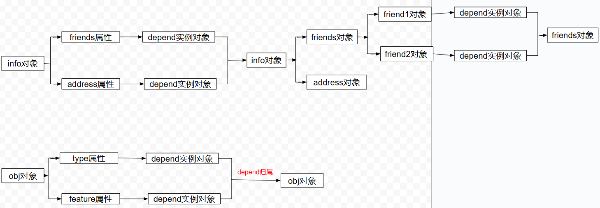

# 响应式原理

<div class="tip-box">
<h2>前言：</h2>
<div>在实际框架中的响应式体现，是基于对象的响应式，如Vue中的Ref。其中一个原因：原始数据类型不可变，不能被直接修改，任何“修改”实际上是创建一个新值。如果原始数据直接用作响应式数据，每次变更都需要替换旧值，检测该变化会变得复杂和低效，而封装成对象，可以持有一个可变的引用，当数据更新，只需修改对象状态，可以更容易地追踪和响应这些变化，且对象更方便扩展、不变动原有内容。</div>
<div>下面，正对对象形式数据实现响应式原理。</div>
</div>

## Vue3 响应式操作

<div class="code-title">代码实现：</div>

```js
// 一、Depend类 收集依赖，通知依赖 两步核心框架
class Depend {
  constructor() {
    // this.reactiveFns = [] //依赖组
    // 2. 采用Set，解决重复收集依赖的问题
    this.reactiveFns = new Set();
  }
  /* // 收集依赖
    addDepend(reactiveFn){
        this.reactiveFns.push(reactiveFn)
    } */
  // 更好的依赖收集
  depend() {
    // if(activeReactiveFn) this.reactiveFns.push(activeReactiveFn)
    // 换成Set的add方法
    if (activeReactiveFn) this.reactiveFns.add(activeReactiveFn);
  }
  // 对所有依赖进行统一通知处理
  notify() {
    console.log(`this.reactiveFns===>`, this.reactiveFns);
    this.reactiveFns.forEach((fn) => {
      // 遍历依赖处理
      if (fn) fn();
    });
  }
}

let activeReactiveFn = null;
// watchFn函数：注册一个响应式函数，并在执行该函数时，
// 把它设置为全局的activeReactiveFn，方便依赖收集
function watchFn(fn) {
  activeReactiveFn = fn;
  // fn()函数：对响应式数据的读取，一旦读取，
  // 这个函数就会被注册为依赖，并在数据变化时触发执行
  fn();
  // 用完置空，释放内存
  activeReactiveFn = null;
}

// 二、实现依赖收集的核心逻辑
// 封装一个获取depend函数
const targetMap = new WeakMap();
function getDepend(target, key) {
  // 1. 根据target对象获取map的过程
  let map = targetMap.get(target);
  if (!map) {
    map = new Map();
    targetMap.set(target, map);
  }
  // 2. 根据对象属性获取depend依赖
  let depend = map.get(key);
  if (!depend) {
    depend = new Depend();
    map.set(key, depend);
  }
  return depend;
}

// 三、封装响应式函数：get 收集依赖；set 依赖更新
// reactive函数将对象转化为响应式
function reactive(obj) {
  if (typeof obj !== "object" || obj === null) {
    return obj; //如果不是对象类型或是null，直接返回
  }
  // 使用proxy监听对象变化
  return new Proxy(obj, {
    get: function (target, key, receiver) {
      // 1. 锁定确定的对象属性
      const depend = getDepend(target, key);
      // 2. 为确定的属性进行添加对应的依赖
      // depend.addDepend(activeReactiveFn)
      // 优化
      depend.depend();
      const result = Reflect.get(target, key, receiver);
      // 3. 如果是对象，递归处理该对象的属性
      return reactive(result);
    },
    set: function (target, key, newValue, receiver) {
      const oldValue = target[key]; //target：需要响应式的对象，key：对象属性
      const result = Reflect.set(target, key, newValue, receiver);

      // 4. 如果值发生变化，通知依赖更新
      if (oldValue !== newValue) {
        // 做到一个属性都有一个对应的depend依赖
        const depend = getDepend(target, key); //获取属性对应的依赖
        depend.notify();
      }
      return result;
    },
  });
}
// 需要响应式的数据
const obj = {
  type: "dog",
  feature: "look house",
};
// 需要响应式的数据2
const info = {
  // 对象内的对象
  friends: {
    friend1: "cat",
    friend2: "chicken",
  },
  address: "hubei",
};
// 响应式开关媒介
const objRef = reactive({
  type: "dog",
  feature: "look house",
});
const infoRef = reactive({
  friends: {
    friend1: "reactive--cat",
    friend2: "chicken",
  },
  address: "hubei",
});
watchFn(() => {
  console.log(`objRef.type->`, objRef.type);
});
watchFn(() => {
  console.log(`infoRef.friends.friend1->`, infoRef.friends.friend1);
});
watchFn(() => {
  console.log(`infoRef.address->`, infoRef.address);
});

infoRef.friends.friend1 = "响应式-好朋友";
infoRef.address = "响应式-hubei";
objRef.type = "响应式--cat";

// objRef.type-> dog
// infoRef.friends.friend1-> reactive--cat
// infoRef.address-> hubei
// this.reactiveFns===> Set(1) { [Function (anonymous)] }
// infoRef.friends.friend1-> 响应式-好朋友
// this.reactiveFns===> Set(1) { [Function (anonymous)] }
// infoRef.address-> 响应式-hubei
// this.reactiveFns===> Set(1) { [Function (anonymous)] }
// objRef.type-> 响应式--cat
```

<!--  -->


## Vue2 响应式操作

1. 相对于 Vue3 而言，Vue2 的响应式逻辑保持一致，只是在 reactive 函数中，对操作拦截的是 `defineProperty`

<div class="code-title">代码实现：</div>

```js
// Vue2响应式核心
function reactive(obj) {
  Object.keys(obj).forEach((key) => {
    let value = obj[key];
    // 如果属性是对象类型，递归调用reactive来处理深层对象
    if (typeof value === "object" && value !== null) {
      reactive(value);
    }
    Object.defineProperty(obj, key, {
      get: function () {
        const depend = getDepend(obj, key);
        depend.depend();
        return value;
      },
      set: function (newValue) {
        value = newValue;
        // 如果新值是对象，递归处理该新对象
        if (typeof value === "object" && value !== null) {
          reactive(value);
        }
        const depend = getDepend(obj, key);
        depend.notify();
      },
    });
  });
  return obj;
}
```

## React 响应式操作

1. React 响应式从 18 版本开始，采用 Hook 形式的 setState 函数。传入想要变成响应式的内容(初始值)，但在返回值的使用上略有不同。
2. 返回`index`与`setIndex`。`index`为响应式内容，`setIndex`是个方法，和 Vue 中 Depend 类中的 notify 方法相同
3. Vue 自动处理，React 手动设置。React 将选择权交给开发者，操作更加自由。
   - `const [index, setIndex] = useState(0)`
