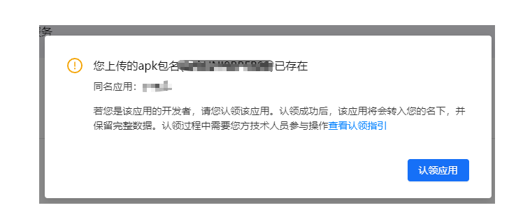
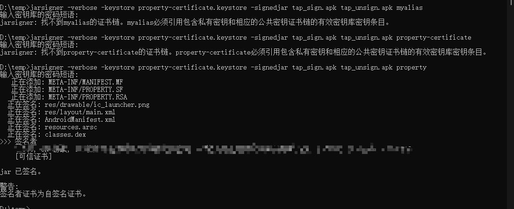
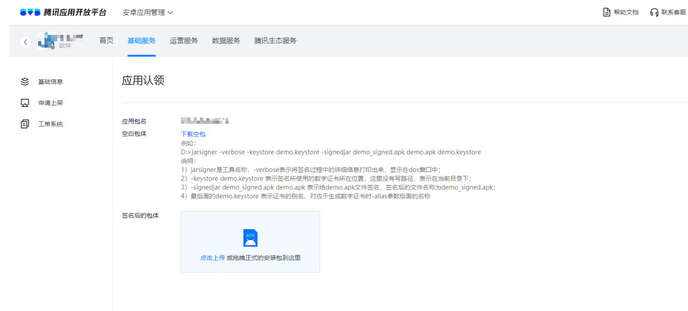

# uniapp 开发 App 问题

## 1. web-view 引入 HTML 页面，安卓手机实现页面缩放

```html
<template>
  <view>
    <web-view src="https://www.baidu.com/"></web-view>
  </view>
</template>
```

```js
<script>
var wv; //计划创建的webview
export default {
  onReady() {
    // #ifdef APP-PLUS

    var currentWebview = this.$scope.$getAppWebview(); //获取当前页面的webview对象

    setTimeout(function () {
      wv = currentWebview.children()[0];
      wv.setStyle({ scalable: true });
    }, 1000); //如果是页面初始化调用时，需要延时一下

    // #endif
  },

  /* onLoad() {
    // #ifdef APP-PLUS
        wv = plus.webview.create("","custom-webview",{
            plusrequire:"none", //禁止远程网页使用plus的API，有些使用mui制作的网页可能会监听plus.key，造成关闭页面混乱，可以通过这种方式禁止
            'uni-app': 'none', //不加载uni-app渲染层框架，避免样式冲突
            top:uni.getSystemInfoSync().statusBarHeight+44 //放置在titleNView下方。如果还想在webview上方加个地址栏的什么的，可以继续降低TOP值
            })
            wv.loadURL("https://www.baidu.com/")
            var currentWebview = this.$scope.$getAppWebview(); //此对象相当于html5plus里的plus.webview.currentWebview()。在uni-app里vue页面直接使用plus.webview.currentWebview()无效currentWebview.append(wv);//一定要append到当前的页面里！！！才能跟随当前页面一起做动画，一起关闭
            setTimeout(function() {
                console.log('wv.getStyle()',wv.getStyle())
                }, 1000);//如果是首页的onload调用时需要延时一下，二级页面无需延时，可直接获取
    // #endif
}, */
  data() {
    return {};
  },
  methods: {},
};

</script>
```

## App 上传应用宝，应用认领命令

app 上传应用宝，apk 上传后弹出提示，需要认领应用



根据官方提示：就是下载官方提供的一个未签名的 apk，然后用自己的 app 密钥和别名对其进行签名，然后把签名成功的 apk 上传上去，等待官方审核成功之后，就认领成功了。
操作步骤：

- 1）将下载的空包 `tap_unsign.apk` 和自己的应用的签名文件 `property-certificate.keystore`拷贝到同一个文件夹下，如 `D:\temp\`；
- 2）cmd 进入目标 `D:\temp>`，然后输入命令：

  ```cmd
   jarsigner -verbose -keystore property-certificate.keystore -signedjar tap_sign.apk tap_unsign.apk property
  ```

  **说明：** `tap_sign.apk`就是`property-certificate.keystore`签名后的`tap_unsign.apk`的文件名；`property`：是创建`property-certificate.keystore`的别名

  

**注意：**

1. 密码输入错误，会出现 Keystore was tampered with, or password was incorrect（密钥库被篡改，或者密码不正确)；
2. 密码正确，但提示找不到 xxx 的证书链。xxx 必须引用包含私有密钥和相应的公共密钥证书链的有效密钥库密钥条目，，即 是别名填写错误。

【所以，密钥文件、别名、密钥文件密码都要正确，才能给 apk 签名成功】

- 3） 然后将签名后的`tap_sign.apk`上传到腾讯即可。

  
