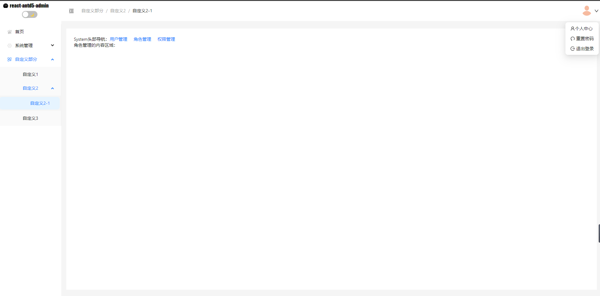
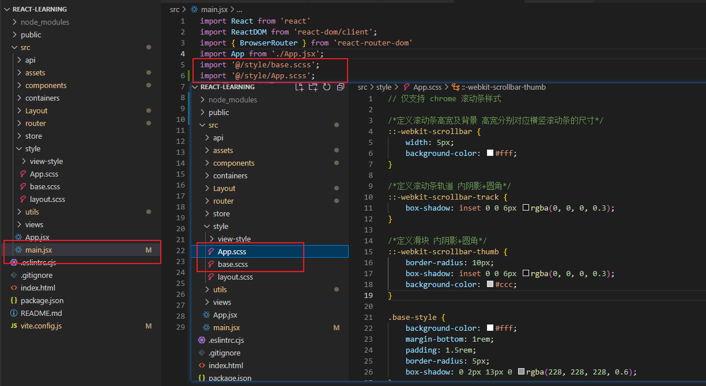
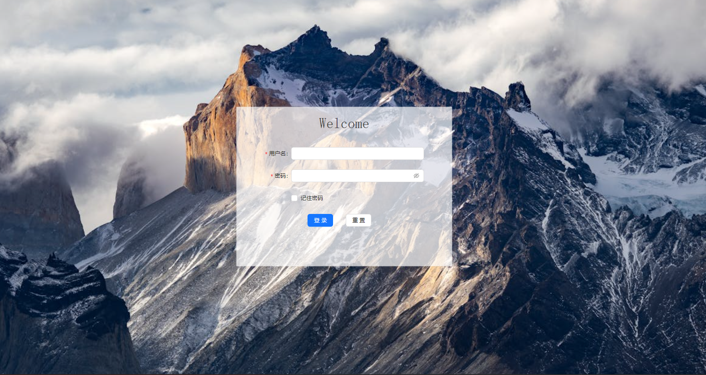
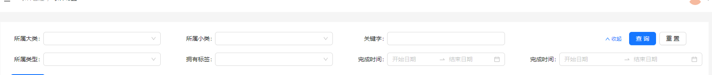

# 简介

## 概述

1. React 结合 UI 框架 Antd5 实践练习搭建后台管理系统框架。
2. 六个模块：项目初始化；路由配置；redux 配置及 axios 封装；登录模块；个人中心模块；紫铜管理模块。
3. 权限管理【用户管理、角色管理、用户管理】



## 技术栈

- JavaScript、React 18、axios、less/sass、node.js ≥ 16
- 脚手架：create-react-app
- 路由管理：react-router-dom v6
- 状态管理：redux
- UI 框架：Antd5

## 项目初始化

```CMD
脚手架创建： cnpm create-react-app react-leanring
按照指示输入命令
cd react-leanring
npm run dev
```

## 简化脚手架

1. 删掉不必要的文件，项目文件结构改成如下：

```css
react-leanring/
├── node_modules/
├── public/
├── src/
│   ├── assets/
│   ├── components/
│   ├── App.jsx
│   └── main.jsx
├── .gitignore
├── index.html
├── package.json
├── README.md
├── vite.config.js

```

2. 简化代码

- src/App.js

```js
import React from 'react'
​
const App = () => {
  return (
    <div>App</div>
  )
}
​
export default App
```

- src/main.js

```js
import React from 'react';
import ReactDOM from 'react-dom/client';
import App from './App';
​
const root = ReactDOM.createRoot(document.getElementById('root'));
root.render(
    <App />
);
```

- vite.config.js 文件,可修改运行端口号,设置路径别名

```js
import { defineConfig } from "vite";
import react from "@vitejs/plugin-react";
import path from "path";
export default defineConfig({
  plugins: [react()],
  server: {
    port: 3003,
  },
  // 设置路径别名
  resolve: {
    alias: {
      "@": path.resolve(__dirname, "./src/"),
    },
  },
});
```

**修改完成后，重新执行启动命令 `npm run dev`。运行成功即可**

## 安装和编写样式

### 编写公有样式

```css
cnpm install sass -D
```

1. 创建 src/style 文件夹,创建 App.sass、base.sass 文件编写公共样式，并在 main.jsx 文件中引入



### 页面私有样式编写

1. 页面文件需要编写私有样式在同名文件夹下创建 xx.module.scss 文件，在页面中引入

```css
import classes from './Login.module.scss'
```

2. 用 classes 对象去访问样式名

```xml
<div className={classes.login}>
    <div className={classes['login-container']}>
        <div className={classes['login-text']}>{welcomeText}</div>
        <div className={classes['login-form']}>
         ... 更多内容 ...
        </div>
    </div>
</div>

```

**注意：** 在 React 项目中，所有引入的 css、scss 或其他后缀文件最终打包后同类名可能会存在样式冲突问题，所以需要用 CSS Modules 解决。采用 vite 打包， Vite 是默认支持 CSS Modules 的。

### package.json 命令配置

```json
{
  "name": "react-learning",
  "private": true,
  "version": "0.0.0",
  "type": "module",
  "scripts": {
    "dev": "vite",
    "build": "vite build",
    "lint": "eslint . --ext js,jsx --report-unused-disable-directives --max-warnings 0",
    "preview": "vite preview"
  }
}
```

**重新 执行启动命令 `npm run dev`。运行成功即可**

---

## 路由配置

### 安装路由库

```cmd
cnpm install react-router-dom
```

### 配置入口文件

main.jsx 入口文件使用 BrowserRouter 或 HashRouter 标签包裹根组件 App。

```js
import React from "react";
import ReactDOM from "react-dom/client";
import { BrowserRouter } from "react-router-dom";
import App from "./App.jsx";
import "@/style/base.scss";
import "@/style/App.scss";

const root = ReactDOM.createRoot(document.getElementById("root"));
root.render(
  <BrowserRouter>
      <App />
  </BrowserRouter>
);
```

- BrowserRouter 使用的是 H5 的 history API，不兼容 IE9 及以下版本。HashRouter 使用的是 URL 的哈希值。
- url 呈现形式不同

```xml
BrowserRouter`的路径中没有#,例如：`localhost:3000/demo/test
HashRouter`的路径包含#,例如：`localhost:3000/#/demo/test
```

- 刷新后 HashRouter 会导致路由 state 参数丢失，而 BrowserRouter 不会（因为 state 对象存放在 history 对象中）

### 配置路由表

src 下新建文件 router/index.jsx 里面用来存放路由表(类型是数组，格式为 {path: '/xxx', element: <xxx />})

```jsx
import Home from '@/pages/Home/Home'
import { Navigate } from 'react-router-dom'
​
const routes = [
  // 访问/时重定向到/home
  {
    path: '/',
    element: <Navigate to="/home" replace />
  },
  {
    path: 'home',
    element: <Home />
  }
]
export default routes
```

### 编写页面

src 下新建文件 views/Home/index.jsx 存放路由文件

```jsx
import React from "react";
const Home = () => {
  return <div>Home</div>;
};
export default Home;
```

### 修改根组件

在根组件 App.jsx 中用 useRoutes hook 包裹路由表

```jsx
import React from 'react'
import { useRoutes } from 'react-router-dom'
import routes from '@/router'
const App = () => {
  const element = useRoutes(routes)
  return <div>{element}</div>
}
​
export default App
```

npm run dev 启动项目跳转首页成功即配置成功

## 嵌套路由配置

### 添加布局组件 Layout

1. 首先是配置路由表。让访问 "/" 时直接跳转到 "/home"，使用 { index: true, element: <Navigate to="/home" replace />} 配置索引路由

> 索引路由可以被认为是“默认路由”。当父路由有多个子路由，但 URL 仅在父路由的路径上时，可能需要将某些内容呈现到 outlet 中。

```jsx
【src/router/index.jsx】

const routes = [
    // 访问/时重定向到/home
    {
        path: '/',
        title: '首页',
        element: <Layout />,
        children: [
            { index: true, element: <Navigate to={'/home'} replace />},
            { path: 'home', element: <Home />},
        ]
    },
]
```

2. 接着编写 Layout 页面

```jsx
`src/Layout/index.jsx`

import React from 'react'
import { Link, Outlet } from 'react-router-dom'
​
const Layout = () => {
  return (
    <div>
      <div style={{ marginBottom: 20 }}>
        Layout的头部导航：
        <Link to="/home" style={{ marginRight: 20 }}>
          首页
        </Link>
      </div>
      Layout的内容区域
      <Outlet />
    </div>
  )
}
​
export default Layout
```

启动项目看到路径不是"/" 而是 "/home"，说明重定向成功

### 添加嵌套路由

**src/router/index.jsx**

```jsx
import { lazy } from "react";
import { Navigate } from "react-router-dom";

// 路由懒加载优化加载性能
const Layout = lazy(() => import("@/Layout"));
const Home = lazy(() => import("@/views/Home"));
const System = lazy(() => import("@/views/System"));
const User = lazy(() => import("@/views/System/User"));
const Role = lazy(() => import("@/views/System/Role"));
const Auth = lazy(() => import("@/views/System/Auth"));
const View404 = lazy(() => import("@/views/otherViews/404/404.jsx"));
const View500 = lazy(() => import("@/views/otherViews/500/500.jsx"));

const routes = [
  {
    path: "/",
    title: "首页",
    hidden: true,
    element: <Layout />,
    children: [
      { index: true, element: <Navigate to={"/home"} replace /> },
      { path: "home", title: "首页", element: <Home />, hidden: false },
    ],
  },
  {
    path: "system",
    title: "系统管理",
    element: <Layout />,
    children: [
      { index: true, element: <Navigate to="/system/user" replace /> },
      {
        path: "/system/user",
        element: <User />,
      },
      {
        path: "/system/role",
        element: <Role />,
      {
        path: "/system/auth",
        element: <Auth />,
      },
    ],
  },
  { path: "404", title: "404页面", element: <View404 />, hidden: true },
  { path: "500", title: "500页面", element: <View500 />, hidden: true },
];

export default routes;
```

**src/views/System/index.jsx**

```jsx
import React from "react";
import { Link, Outlet } from "react-router-dom";

const System = () => {
  return (
    <div>
      <div>
        System头部导航：
        <Link to="/system/user" style={{ marginRight: 20 }}>
          用户管理
        </Link>
        <Link to="/system/role" style={{ marginRight: 20 }}>
          角色管理
        </Link>
        <Link to="/system/auth">权限管理</Link>
      </div>
      System的内容区域：
      <Outlet />
    </div>
  );
};

export default System;
```

在 src/Layout/index.jsx 页面文件中添加 <Link to="/system">系统管理</Link>。系统管理子菜单组件页面内容自行在 `src/views/System/User/index.jsx`、`src/views/System/Role/index.jsx`、`src/views/System/Auth/index.jsx` 中编写。
点击系统管理直接跳转到 用户管理。再点击导航链接回到首页没什么问题。即完成嵌套路由的配置工作。

## Redux 状态管理

### 安装和创建 store 对象

> redux 是通过 state 来存储装填，通过 action 事件来管理和更新状态。以集成 Store 的方式对整个应用中使用的状态进行集中管理，确保状态只能以可预测的方式更新。

1. 安装

```cmd
cnpm install @reduxjs/toolkit react-redux --save
```

2. 创建切片

在 src 下创建文件夹 store，再创建 reducers 文件夹（用来保存用户信息、token 的状态），再创建 userSlice.js 文件表明为用户的状态切片，代码如下：

**src/store/reducers/userSlice.js**

```js
import { createSlice } from "@reduxjs/toolkit";
import { getToken } from "@/utils/auth";
/**
 * 创建一个用户状态切片
 */
const userSlice = createSlice({
  // 用来作为区分action的名称
  name: "user",
  // 状态初始值
  initialState: () => {
    // 如果localStorage中有从其中取，否则为null
    const token = getToken() || null;
    return {
      token,
      userinfo: { username: "Alan" },
    };
  },
  // 状态操作方法
  reducers: {
    setUserinfo(state, action) {
      const { payload } = action;
      state.userinfo = payload;
    },
  },
});
// 导出经过redux包装的action对象
export const { setUserinfo } = userSlice.actions;
// 导出切片对象
export default userSlice;
```

3. 创建 store 对象

**src/store/index.js**

```js
import { configureStore } from '@reduxjs/toolkit'
import userSlice from './reducers/userSlice'
// 创建store对象
const store = configureStore({
  reducer: {
    user: userSlice.reducer
  }
})
​
export default store
```

### 在 React 组件中使用 Redux

`react-redux` 库主要作用是连接 `Redux Store` 和 `React` 组件。

1. 创建 store 后，通过在 src/main.js 中的应用程序外层放置一个 React Redux `<Provider />` 来将 store 作为 prop 传递给整个应用程序。

**src/main.js**

```js
import React from 'react'
import ReactDOM from 'react-dom/client'
import { BrowserRouter } from 'react-router-dom'
import App from './App'
import '@/style/base.scss';
import '@/style/App.scss';
// 导入redux相关库及文件
import store from './store'
import { Provider } from 'react-redux'
​
const root = ReactDOM.createRoot(document.getElementById('root'))
root.render(
<Provider store={store}>
    <BrowserRouter>
      <App />
    </BrowserRouter>
</Provider>
)
```

2. 在 React 组件中使用 Redux State 和 Actions
   react-redux 提供的两个狗子函数 useSelector 和 useDispatch，可以方便的得到 state 和操作 state。

**src/views/Home**

```jsx
import React from 'react'
import { useDispatch, useSelector } from 'react-redux'
import { setUserinfo } from '@/store/reducers/userSlice'
​
const Home = () => {
 // 通过react-redux的useSelector钩子得到username
 const username = useSelector((state) => state.user.userinfo.username)
 // 分发action的钩子
 const dispatch = useDispatch()
return (
  <div>
    <h2>Home</h2>
     <h2>Username:{username}</h2>
     <button onClick={() => dispatch(setUserinfo({ username:'Tom' }))}>设置用户名为Tom</button>
    </div>
  )
}
export default Home
```

最后在 Home 页面，点击“设置用户名为 Tom”按钮，上方的 username 即变成 Tom。说明在 React 组件中使用 Redux State 和 Actions 成功。

## Axios 封装

### 安装和封装 axios

1. 安装 axios 与 UI 框架 antd

```cmd
cnpm install axios
cnpm install antd --save
```

2. 封装 axios
   src 下创建 utils 文件夹，再创建 request.js 文件。随后设置请求拦截器，如果请求的是业务接口那么请求头带上 token，如果不是的话加入白名单。响应拦截器则需要对返回 blob 文件流和正常业务数据做判断，文件流直接返回，业务数据返回 data 数据。代码如下：

**src/utils/request.js**

```js
import Axios from "axios";
import { getToken } from "@/utils/auth";
// message提示接口响应
import { message } from "antd";

const BASE_URL = process.env.NODE_ENV === "production" ? "" : "/api/v1";
const TIME_OUT = 20000; //接口超时时间
const RESPOND_CODE_UNAUTHORIZED = 4001; //未授权
const RESPOND_CODE_SESSION_GONE = 4002; //session过期

const createAxiosInstance = (options = {}) => {
  const instance = Axios.create({
    baseURL: options.baseURL || BASE_URL,
    timeout: TIME_OUT,
  });

  // 设置白名单
  const whiteList = [];

  // 请求拦截器
  instance.interceptors.request.use(
    /* (config)=>{
        if(config.url && typeof config.url === 'string'){
            if(!whiteList.includes(config.url)){
                let Token = getToken()
                if(Token && Token.length > 0) {
                    config.headers && (config.headers[Authorization] = Token)
                }
            }
        }
        return config
    }, */
    (config) => {
      // console.log(`output->config`,config)
      // console.log(`output->options`,options)
      if (!whiteList.includes(config.url)) {
        config.headers = {
          Authorization: getToken(),
          ...config.headers,
          ...options?.headers,
        };
        return config;
      }
    },
    (error) => {
      return Promise.reject(error);
    }
  );
  // 响应拦截器
  instance.interceptors.response.use(
    (response) => {
      // 如果返回的类型是二进制文件类型
      if (response.config.responseType === "blob") {
        if (response.status !== 200) {
          message.error("请求失败" + response.status);
          return Promise.reject();
        } else if (!response.headers["content-disposition"]) {
          message.error("暂无接口访问权限");
          return Promise.reject();
        }
        return response;
      } else if (response.status == 200) {
        const { code, err_msg, data } = response.data;
        // 响应成功
        if (code === 0) {
          // 是否显示服务器返回成功提示语
          if (options.isShowMessage) {
            message.success(err_msg);
          }
          // 自定义返回成功提示语
          if (options.msg) {
            message.success(options.msg);
          }
        } else {
          message.error(err_msg);
          //session过期,跳转登录页面
          if (
            code === RESPOND_CODE_UNAUTHORIZED ||
            code === RESPOND_CODE_SESSION_GONE
          ) {
            window.location.href = "/login/";
            // let errMsg = response.data.message || '系统错误'
            // return Promise.reject(errMsg)
          }
        }
        return data;
      }
    },
    (error) => {
      console.log(`output->error`, error);
      message.error(error.message);
      return Promise.reject(error);
    }
  );
  console.log(`output->instance`, instance);
  return instance;
};

export const GET = (url, params, option) =>
  createAxiosInstance(option).get(url, { params }, option);

export const DELETE = (url, params, option) =>
  createAxiosInstance(option).delete(url, { data: params, ...option });

export const POST = (url, params, option) =>
  createAxiosInstance(option).post(url, { ...params, ...option });

export const PUT = (url, params, option) =>
  createAxiosInstance(option).put(url, { ...params, ...option });
```

### 跨域配置

**vite.config.js**文件

```js
import { defineConfig } from "vite";
import react from "@vitejs/plugin-react";
import path from "path";
export default defineConfig({
  plugins: [react()],
  server: {
    port: 3003, //修改启动端口号
    // 设置代理地址
    proxy: {
      "/api": {
        target: "http://127.0.0.1:4523/m1/mack/1049809-0-default",
      },
    },
  },
  // 设置路径别名
  resolve: {
    alias: {
      "@": path.resolve(__dirname, "./src/"),
    },
  },
});
```

### 封装接口和测试接口

1. 封装接口

src 下新建 api 文件夹，再新建 user.js 文件,放置所有有关用户的接口。

**src/api/user.js**

```js
import { POST, GET, PUT, DELETE } from "@/utils/request";

const userApi = {
  login: (params, option) => POST("/user/login", params, option), //登录
  getUserInfo: (params, option) => GET("/user/info", params, option), //获取登录用户详情
};

export default userApi;
```

2. 测试接口

**src/views/Home/index.jsx**

```jsx
import React, { useEffect } from "react";
import userApi from "@/api/user";
const Home = () => {
  useEffect(() => {
    const fetchCode = async () => {
      const params = {
        account: "test",
        password: "test123",
        code: "weiyi",
      };
      const code = await userApi.login(params);
      console.log(code);
    };
    fetchCode();
  }, []);
  return <div>Home</div>;
};
export default Home;
```

### 演示封装 axios 详细且丰富的用法

**src/api/dictionary.js**

```js
import { POST, GET, PUT, DELETE } from "@/utils/request";
const dictionaryApi = {
  getDictionaryDetail: (params, option) =>
    GET(`/sysDictionary/${params.id}`, params, option), //获取字典详情
};
```

**src/hooks/useDict.js**

```js
import { useEffect, useState } from "react";
import dictionaryApi from "@/api/dictionary";

export const useDict = (dictParams) => {
  const [dictionary, setDictionary] = useState([]);
  useEffect(() => {
    const fetchDictionary = async () => {
      // 演示返回服务端请求成功提示语
      // const res = await dictionaryApi.getDictionaryDetail( dictParams , {baseURL: '/api/v2', isShowMessage: true} )
      // 自定义请求成功提示语，动态修改baseURL，dictParams 是请求参数[具体看接口定义]
      const res = await dictionaryApi.getDictionaryDetail(dictParams, {
        baseURL: "/api/v2",
        msg: "获取成功",
      });
      console.log(`output->打印返回数据`, res);
    };
    fetchDictionary();
  }, [dictParams]);
  return dictionary;
};

export default dictionaryApi;
```

**src/views/Home/index.jsx**

```jsx
import React from "react";
import { useDict } from "@/hook/useDict";

const Home = () => {
  // 字典类型字段
  const dictionaryType = useDict({
    id: "dictionary_type",
    page: 1,
    pageSize: 200,
  });
  console.log("打印获取字典类型", dictionaryType);
  return <div>content内容区域</div>;
};

export default Home;
```

## Redux 异步操作

在 redux 中进行异步操作，需要 Redux-Thunk 中间件。

> Redux Thunk 是 Redux 官方推荐用于处理异步操作的中间件。允许在 Redux action 中返回函数而不仅仅是纯对象。便于在 action 中进行异步操作，并在操作完成后分发一个新的 action。

在 `Redux-Toolkit`工具包中已经内置了 thunk 插件，不需要单独安装 `Redux-Thunk` 中间件，可直接处理异步的 action。

### 登录、更新用户信息异步方法

1. 浏览器 loaclStorage 处理 token、refreshToken 方法。

**src/utils/auth.js**

```js
// 设置token键值
const TokenKey = "ACCESS-TOKEN";
// 获取token
const getToken = () => {
  return window.localStorage.getItem(TokenKey);
};
// 设置token
const setToken = (token) => {
  return window.localStorage.setItem(TokenKey, token);
};
// 移除token
const removeToken = () => {
  return window.localStorage.removeItem(TokenKey);
};
// refreshToken键值
const refreshTokenKey = "REFRESH-TOKEN";
const getRefreshToken = () => {
  return window.localStorage.getItem(refreshTokenKey);
};
const setRefreshToken = (token) => {
  return window.localStorage.setItem(refreshTokenKey, token, { expires: 2 });
};
const removeRefreshToken = () => {
  return window.localStorage.removeItem(refreshTokenKey);
};
export {
  getToken,
  setToken,
  removeToken,
  getRefreshToken,
  setRefreshToken,
  removeRefreshToken,
};
```

2. `userSlice.js`文件中编写登录和登出同步 action。更新 state 中的 token 和 refreshToken

```js
--代码片段--
 reducers: {
        // 编写登录登出同步action
        login(state, action) {
            state.token = action.payload.token
            state.refreshToken = action.payload.refreshToken
            setToken(state.token)
            setRefreshToken(state.refreshToken)
        },
        logout(state, action){
            state.token = null
            state.refreshToken = null
            state.userinfo = null
            // 移除存储中的信息
            removeToken()
            removeRefreshToken()
        },
        setUserinfo(state, action) {
            const { payload } = action
            console.log(`setUserinfo====>payload`,payload)
            state.userinfo = payload;
        }
    }
```

3. 编写获取用户信息的异步方法。更新用户组状态(数据)

```js
--userSlice.js 代码片段--
// 导出经过redux包装后的action对象
export const { login, logout, setUserinfo } = userSlice.actions
// 导出获取登录用户信息的异步方法
export const getUserInfoAsync = () => async (dispatch) => {
  const data = await userApi.getUserInfo();
  dispatch(setUserinfo(data));
  return data;
};
```

4. 编写登录的异步 action。调用登录及获取登录用户信息的接口，并分发同步的登录方法更新 token、refreshToken 状态。

```js
// 登录异步方法
export const loginAsync = (payload) => async (dispatch) => {
  const res = await userApi.login(payload);
  dispatch(login(res));
  //   const userinfo = await dispatch(getUserInfoAsync());
  //   dispatch(generateRoutes(userinfo.permissions));
};
```

### Redux 切片处理用户权限

在 store 下的 reducers 文件夹新建`permissionSlice.jsx`文件，来处理服务器返回的权限数组。权限路由中的 permission 标识与用户数据返回的 permissions 数组进行对比，如果权限数组中包含该路由的权限标识，则显示该路由，否则不显示该路由。

**这里默认的服务器返回数据如下：**

```json
{
  "id": 10,
  "name": "我是名字",
  "mobile": "12345678901",
  "account": "test",
  "permisssions": ["project-user-page", "system-user-page", "project-user-add", "project-user-edit", "project-user-delete", ...]
  ......
}
```

### 改造路由

对所有的路由页面设置 permissions 权限数组。

**src/router/index.jsx**

```jsx
import { lazy } from "react";
import { Navigate } from "react-router-dom";
// 路由懒加载优化加载性能
const Layout = lazy(() => import("@/Layout"));
const Home = lazy(() => import("@/views/Home"));
const System = lazy(() => import("@/views/System"));
const User = lazy(() => import("@/views/System/User"));
const Role = lazy(() => import("@/views/System/Role"));
const Auth = lazy(() => import("@/views/System/Auth"));
const Login = lazy(() => import("@/views/Login"));
const View404 = lazy(() => import("@/views/otherViews/404/404.jsx"));
const View500 = lazy(() => import("@/views/otherViews/500/500.jsx"));

const allRoutes = [
  { path: "login", title: "登录", element: <Login />, hidden: true },
  {
    path: "/",
    title: "首页",
    hidden: true,
    element: <Layout />,
    children: [
      { index: true, element: <Navigate to={"/home"} replace /> },
      { path: "home", title: "首页", element: <Home />, hidden: false },
    ],
  },
  {
    path: "system",
    title: "系统管理",
    icon: "xitong",
    hidden: false,
    element: <Layout />,
    children: [
      { index: true, element: <Navigate to="/system/user" replace /> },
      {
        path: "/system/user",
        menuPath: "/system/user",
        element: <User />,
        title: "用户管理",
        hidden: false,
        permission: "system-user-page",
      },
      {
        path: "/system/role",
        menuPath: "/system/role",
        element: <Role />,
        title: "角色管理",
        icon: "jiaoseliebiao",
        hidden: false,
        permission: "system-role-page",
      },
      {
        path: "/system/auth",
        menuPath: "/system/auth",
        element: <Auth />,
        title: "权限管理",
        hidden: false,
        permission: "project-area-page",
      },
    ],
  },
  {
    path: "project",
    title: "自定义部分",
    icon: "tianjiazidingyiyingyong",
    hidden: false,
    element: <Layout />,
    children: [
      { index: true, element: <Navigate to="/project/user" replace /> },
      {
        path: "/project/user",
        menuPath: "/project/user",
        element: <User />,
        title: "自定义1",
        hidden: false,
        permission: "project-user-page",
      },
      {
        path: "project2",
        menuPath: "/project/project2",
        title: "自定义2",
        icon: "system",
        hidden: false,
        element: null,
        children: [
          {
            index: true,
            element: <Navigate to="/project/project2/role" replace />,
          },
          {
            path: "/project/project2/role",
            menuPath: "/project/project2/role",
            element: <Role />,
            title: "自定义2-1",
            hidden: false,
            permission: "project-event-page",
          },
        ],
      },
      {
        path: "/project/auth",
        menuPath: "/project/auth",
        element: <Auth />,
        title: "自定义3",
        hidden: false,
        permission: "project-workplan-view",
      },
      {
        path: "/project/auth2",
        menuPath: "/project/auth2",
        element: <Auth />,
        title: "自定义3-2",
        hidden: false,
        permission: "project-workplan-view2",
      },
    ],
  },
  { path: "404", title: "404页面", element: <View404 />, hidden: true },
  { path: "500", title: "500页面", element: <View500 />, hidden: true },
];

export default allRoutes;
```

### 创建用户权限切片

**src/store/reducers/permissionSlice.jsx**

```js
import { createSlice } from "@reduxjs/toolkit";
// 转换动态路由结构
import allRoutes from "@/router";

// 得到动态权限路由
const permissionSlice = createSlice({
  name: "permision",
  initialState: {
    // 遍历得到的路由权限匹配为前端router结构
    routes: allRoutes,
    permissionRoutes: [],
  },
  reducers: {
    setRoutes(state, action) {
      state.routes = allRoutes.map((item) => {
        if (item.path === "/") {
          return {
            ...item,
            children: item.children.concat(action.payload.routes),
          };
        }
        return item;
      });
    },
    setPermissionRoutes(state, action) {
      state.permissionRoutes = action.payload.routes;
    },
  },
});

export const { setRoutes, setPermissionRoutes } = permissionSlice.actions;
export default permissionSlice;
```

### 处理权限路由函数

```jsx
--- permissionSlice.jsx ---

const filterRoutes = (routes, permissions)=> {
    return routes.reduce((prev,next)=>{
        if(next.children){
            const prevChildren = filterRoutes(next.children, permissions);
            if(prevChildren.length){
                prev.push({...next, children: prevChildren})
            }
        }else if(permissions.indexOf(next.permission) !== -1){
            prev.push(next)
        }
        return prev
    }, [])
}

export const generateRoutes = (payload)=>(dispatch)=>{
    const accessedRoutes = filterRoutes(allRoutes, payload)
    // 分发全局路由状态(静态+动态)
    dispatch(setRoutes({ routes: accessedRoutes }))
    // 分发动态路由
    dispatch(setPermissionRoutes({routes: accessedRoutes}))
    return accessedRoutes
}
```

1. 将 `permissionSlice.jsx` 引入到 store/index.js 中

```js
...
import permissionSlice from './reducers/permissionSlice.jsx'
// 创建store对象
const store = configureStore({
  reducer: {
    user: userSlice.reducer,
    permission: permissionSlice.reducer
  }
})
...

```

2. 修改 userSlice 登录的异步方法

```js
// 导入加载用户路由的方法
import { generateRoutes } from './permissionSlice.jsx'
// 登录异步方法
export const loginAsync = (payload) => async (dispatch) => {
  const res = await userApi.login(payload);
  dispatch(login(res));
+  const userinfo = await dispatch(getUserInfoAsync());
+  dispatch(generateRoutes(userinfo.permissions));
};
```

3. 修改入口组件 App.jsx
   完成 userSlice 和 permissionSlice 的编写后，可以在页面中进行分发 action 进行全局状态的存储与使用。
   流程：

   1. 判断 localStorage 是否存在 token

   - 存在。获取当前用户信息，并加载当前用户的路由。
   - 不存在。跳转到登录页面让其登录，登录后再执行上一步操作。

   2. 编写 Loading 组件 【待实现】

   > 由于使用 React 的路由动态加载 lazy，需要在 React.Suspense 组件下进行渲染，Suspense 支持传入 fallback 属性，作为动态加载模块完成组件渲染的内容。

   **src/components/Loading/index.jsx**

   ```jsx
   import { Spin } from 'antd'
   import './Loading.scss'
   export default function Loading(props) {
   let { loadingText = '数据加载中...' } = props
   ​
   return (
      <div className="Loading">
        <Spin size="large" />
        <h3 className="loadingText">{loadingText}</h3>
      </div>
   )
   }

   ```

   **src/components/Loading/Loading.scss**

   ```css
   .Loading{
   position: absolute;
   top: 0;
   left: 0;
   width: 100%;
   height: 100%;
   display: flex;
   justify-content: center;
   align-items: center;
   flex-direction: column;
   background: rgba(0, 0, 0, 0.05);
   .loadingText{
      color: #408fff;
   }
   }

   ```

   3. 根组件 App 修改：

```jsx
import React, { Suspense } from "react";
// 导入路由及react-redux钩子
import { useLocation, useNavigate, useRoutes } from "react-router-dom";
import { useDispatch } from "react-redux";
import allRoutes from "@/router";
import { getUserInfoAsync } from "@/store/reducers/userSlice";
import { generateRoutes } from "@/store/reducers/permissionSlice";
import { getToken } from "@/utils/auth";
import { useEffect } from "react";

// 导入loading组件
import Loading from "@/components/Loading";

const App = () => {
  const dispatch = useDispatch();
  // 跳转方法
  const navigate = useNavigate();
  const location = useLocation();
  useEffect(() => {
    const fetchData = async () => {
      if (getToken()) {
        const userInfo = await dispatch(getUserInfoAsync());
        dispatch(generateRoutes(userInfo.permissions));
        // dispatchEvent()
      } else {
        navigate("/login", { replace: true, state: { preLocation: location } });
      }
    };
    fetchData();
  }, [dispatch]);
  const element = useRoutes(allRoutes);
  return (
    <>
      <Suspense>{allRoutes && element}</Suspense>
      {/* 如果是有loading */}
      {/* <Suspense fallback={<Loading />}>{routes && element}</Suspense> */}
    </>
  );
};

export default App;
```

### 测试登录及权限路由页面

**启动运行，控制台可能会出现一条关于 redux 数据序列化的报错，需要在 store 中添加中间件配置把它关掉就不会报错了。**

**src/store/index.js**

```js
...
const store = configureStore({
  reducer: {
    user: userSlice.reducer,
    permission: permissionSlice.reducer
  },
+  middleware: (getDefaultMiddleware) =>
+    getDefaultMiddleware({
+      //关闭redux序列化检测
+      serializableCheck: false
    })
})
...
```

## 登录模块

### 简介

1. 静态页面编写

2. 展示图形验证码

   - 请求接口获取 svg 验证码，需要唯一键值 uuid，再设置一个变量来存储验证码图片(格式为 svg)
   - React 中属性 `dangerouslySetInnerHTML`，可用于表单输入框的后缀来展示验证码。
   - **！`dangerouslySetInnerHTML`慎用，使用不当会有危险【简易查阅资料后选择合适的方法实现】**

```js
<Form.Item label="验证码" name="checkCode" rules={[{ required: true, min: 4, max: 4, message: '请输入正确格式验证码!' }]}>
<Inpu
+ suffix={
+ <div
+ dangerouslySetInnerHTML={{ __html: verifyImg }}
+ className="login-captcha"
+ onClick={() => getCode()}></div>
    }
  />
  </Form.Item>

```

3. 记住密码

   - 勾选记住密码，保存用户登录信息到 localStorage；这里假设设置过期期限为 7 天。每次进入登录页，从 localStorage 中取出信息，回显至表单内。
   - 未勾选记住密码，点击登录清空浏览器存储中的信息。

4. 密码加密；【jsencrypt 库】

   - 在这里，没有实现这一功能，可自行查询实现。

5. 提交登录

   - 提交接口，直接分发到之前封装好的 Redus 登录异步方法存储 token 和 refreshToken

6. 登录重定向至上次浏览页面

   - 当路由页面跳转会跳转到登录页的情况就是无 token，那么在其跳转的时候带一个参数为当前链接即可。
     在登录页用 `location.state?.preLocation?.pathname` 接收跳转路径，然后点击登录请求成功后跳转至此路径。

### 登录页面预览

   

### 页面编写

**src/views/Login/index.jsx**

```jsx
import React, { useEffect, useState } from "react";
import { Button, Checkbox, Form, Input } from "antd";
import classes from "./login.module.scss";
import { loginAsync } from "../../store/reducers/userSlice";
import { Navigate, useNavigate, useLocation } from "react-router-dom";
import { useDispatch } from "react-redux";
import { message } from "antd";
import { cleanEmptyParams } from "@/utils/function";
import verifySvg from "@/assets/images/verify.svg"; //假设为验证码
const Login = () => {
  const dispatch = useDispatch();
  const navigate = useNavigate();
  const location = useLocation();
  const from = location.state?.preLocation?.pathname || "/home";

  const [form] = Form.useForm();
  const [loading, setLoading] = useState(false);
  const onFinish = async (values) => {
    setLoading(true);
    // 记住密码存储用户信息
    if (values.remember) {
      localStorage.setItem("username", values.account, { expires: 7 });
      localStorage.setItem("password", values.password, { expires: 7 });
      localStorage.setItem("remember", values.remember, { expires: 7 });
    } else {
      // 移除用户信息
      localStorage.removeItem("username");
      localStorage.removeItem("password");
      localStorage.removeItem("remember");
    }
    try {
      const loginParams = { ...values, code: "aswy", remember: null };
      await dispatch(loginAsync(cleanEmptyParams(loginParams)));
      setLoading(false);
      // 若上次为登录页，跳转到首页
      if (from === "/login") Navigate("/home", { replace: true });
      else navigate(from, { replace: true });
      message.success("登录成功！");
    } catch (error) {
      console.error(error);
      // getCode()
      setLoading(false);
    }
  };
  // 登录页显示欢迎语
  const [welcomeText, setWelcomeText] = useState("");
  const typeWriter = (wordSplit, index) => {
    if (index < wordSplit.length - 1) {
      setWelcomeText((pre) => {
        index++;
        return pre + wordSplit[index];
      });
      setTimeout(() => typeWriter(wordSplit, index), 200);
    }
  };
  // 验证码uuid
  const [uuid, setUuid] = useState();
  // 验证码svg标签
  const [verifyImg, setVerifyImg] = useState(verifySvg);
  // 获取验证码
  const getCode = () => {
    const uuid = new Date().getTime(); //唯一键值uuid，这里先用当前时间戳模拟
    setUuid(uuid);
    // 进行接口请求svg验证码，假设有接口
    // userApi.login.get(uuid).then((res) => {
    //   setVerifyImg(res.data)
    // })
    // 这里模拟一个新的验证码图片 URL
    // const newVerifyImg = '';
    setVerifyImg(verifySvg);
  };
  // 获取缓存中的用户名密码信息
  const getUser = () => {
    const account = localStorage.getItem("username") ?? "";
    const password = localStorage.getItem("password") ?? "";
    const remember = localStorage.getItem("remember") ?? false;
    // 通过antd表单实例对象的setFieldsValue方法回显值
    form.setFieldsValue({ account, password, remember });
  };

  useEffect(() => {
    let index = -1;
    const wordSplit = "Welcome".split("");
    typeWriter(wordSplit, index);
    // 获取验证码
    // getCode()
    getUser();
  }, []);
  return (
    <div className={classes.login}>
      <div className={classes["login-container"]}>
        <div className={classes["login-text"]}>{welcomeText}</div>
        <div className={classes["login-form"]}>
          <Form
            name="basic"
            form={form}
            labelCol={{ span: 8 }}
            wrapperCol={{ span: 16 }}
            initialValues={{ remember: false }}
            onFinish={onFinish}
            autoComplete="off"
          >
            <Form.Item
              label="用户名"
              name="account"
              rules={[
                {
                  required: true,
                  max: 12,
                  message: "请输入用户名",
                },
              ]}
            >
              <Input />
            </Form.Item>
            <Form.Item
              label="密码"
              name="password"
              rules={[
                {
                  required: true,
                  message: "请输入密码!",
                },
              ]}
            >
              <Input.Password />
            </Form.Item>
            <Form.Item
              label="验证码"
              name="checkCode"
              rules={[
                {
                  required: true,
                  min: 4,
                  max: 4,
                  message: "请输入正确格式验证码!",
                },
              ]}
            >
              <Input
                suffix={
                  // <div
                  // dangerouslySetInnerHTML={{ __html: verifyImg }}
                  // className="login-captcha"
                  // onClick={() => getCode(setVerifyImg)}></div>
                  <div
                    className="login-captcha"
                    onClick={() => getCode(setVerifyImg)}
                  >
                    
                  </div>
                }
              />
            </Form.Item>
            <Form.Item
              name="remember"
              valuePropName="checked"
              wrapperCol={{
                offset: 8,
                span: 16,
              }}
            >
              <Checkbox>记住密码</Checkbox>
            </Form.Item>
            <Form.Item wrapperCol={{ offset: 10, span: 16 }}>
              <Button type="primary" htmlType="submit" loading={loading}>
                登录
              </Button>
              <Button htmlType="reset" style={{ marginLeft: "32px" }}>
                重置
              </Button>
            </Form.Item>
          </Form>
        </div>
      </div>
    </div>
  );
};
export default Login;
```

### Login 样式编写

**src/views/Login/login.module.scss**

```css
.login {
  width: 100%;
  height: 100%;
  position: fixed;
  left: 0;
  top: 0;
  background: center/cover no-repeat
    url("../../assets/images/login/login-background.jpg");
  .login-container {
    width: 500px;
    height: 360px;
    padding: 20px;
    position: absolute;
    left: 50%;
    top: 50%;
    transform: translate(-50%, -50%);
    background-color: rgba(255, 255, 255, 0.2);
    box-shadow: 0 0 2px #eee;
    display: flex;
    flex-direction: column;
    align-items: center;
  }
  .login-text {
    font-size: 36px;
    color: #333;
    margin-bottom: 40px;
  }
  .login-form {
    width: 100%;
    padding-right: 100px;
  }
  .login-captcha {
    width: 100px;
    height: 32px;
    cursor: pointer;
  }
  .login-tip {
    position: absolute;
    right: 80px;
    bottom: 72px;
    font-size: 12px;
    line-height: 20px;
    color: #4a4949;
  }
}
```

## Layout 模块

### 基本框架编写

```jsx
import React, { useState } from 'react'
import { MenuFoldOutlined, MenuUnfoldOutlined, DashboardFilled } from '@ant-design/icons'
import { Layout, Menu, Button, theme, Switch } from 'antd'
import './Layout.scss'
const { Header, Sider, Content } = Layout
​
const LayoutApp = () => {
  const [collapsed, setCollapsed] = useState(false)
  const {
    token: { colorBgContainer }
  } = theme.useToken()
   // 侧边栏主题模式
    const [themeVari, setThemeVari] = useState('light')
    // 切换侧边栏主题颜色
    const changeTheme = (value) => {
        setThemeVari(value ? 'dark' : 'light')
    }
  return (
    <Layout className="layout">
      <Sider trigger={null} collapsible collapsed={collapsed} theme={themeVari}>
        <div className="layout-logo-vertical" style={{ color: themeVari === 'dark' ? '#fff' : '#000' }}>
          <span className="layout-logo">
            {' '}
            <DashboardFilled />
          </span>
          {!collapsed && <span>react-antd5-admin</span>}
        </div>
        <Switch
          className="sider-switch"
          checkedChildren="☀"
          unCheckedChildren="🌙"
          onChange={changeTheme}
          style={{ transform: collapsed ? 'translateX(15px)' : 'translateX(75px)' }}
        />
        <Menu theme={themeVari} mode="inline" defaultSelectedKeys={[]} items={[]} />
      </Sider>
      <Layout>
        <Header
          style={{
            padding: 0,
            background: colorBgContainer
          }}>
          <Button
            type="text"
            icon={collapsed ? <MenuUnfoldOutlined /> : <MenuFoldOutlined />}
            onClick={() => setCollapsed(!collapsed)}
            style={{
              fontSize: '16px',
              width: 64,
              height: 64
            }}
          />
        </Header>
        <Content
          style={{
            margin: '24px 16px',
            padding: 24,
            minHeight: 280,
            background: colorBgContainer
          }}>
          Content
        </Content>
      </Layout>
    </Layout>
  )
}
export default LayoutApp

```

### 头部区域

分为左侧：伸缩侧边栏按钮；右侧：即用户信息区域，用户头像，悬浮下拉框展示修改密码、退出登录功能按钮；中间区域：面包屑

#### 用户头像展示

```jsx
import defaultAvatar from "@/assets/images/avatar/avatar.png";

// 用户头像
const avatar = useSelector((state)=> state.user.userinfo.avatar)

...
<Header
  style={{
    padding: 0,
    background: colorBgContainer,
    display: "flex",
  }}
>
  <Button
    type="text"
    icon={collapsed ? <MenuUnfoldOutlined /> : <MenuFoldOutlined />}
    onClick={() => setCollapsed(!collapsed)}
    style={{
      fontSize: "16px",
      width: 64,
      height: 64,
    }}
  />
  {/* TODO 面包屑 */}
  <div className="header-breadcrumb">
    <Breadcrumb items={breadcrumbItems}></Breadcrumb>
  </div>
  <div className="header-right">
    <Dropdown menu={{ items: dropdownMenuItems }} placement="bottomRight">
      <Space>
        
        <DownOutlined />
      </Space>
    </Dropdown>
  </div>
</Header>;
....

```

#### 下拉菜单

下拉菜单直接用 Antd 有一个 Dropdown 组件包裹上面的用户头像

> Dropdown
>
> - menu：菜单配置项，items 为菜单项数组
>
>   - items：包含菜单项 item 的配置数组
>     - key：菜单项的唯一标识，用于触发点击事件
>     - label：菜单项的显示文本
>
> - placement: 菜单弹出位置： bottom bottomLeft boootmRight top topLeft topRight

```jsx
// 下拉菜单数组项
const dropdownMenuItems = [
  {
    key: "1",
    label: (
      <div onClick={() => toggleCenterStatus(true)}>
        <UserOutlined />
        个人中心
      </div>
    ),
  },
  {
    key: "2",
    label: (
      <Popconfirm
        onConfim={() => toggleResetStatus(true)}
        title="是否确认重置密码？"
        okText="确认"
        cancelText="取消"
      >
        <UndoOutlined /> 重置密码
      </Popconfirm>
    ),
  },
  {
    key: "3",
    label: (
      <Popconfirm
        onConfirm={() => handleLogout()}
        title="是否确认退出？"
        okText="退出"
        cancelText="取消"
      >
        <LogoutOutlined /> 退出登录
      </Popconfirm>
    ),
  },
];
// ===== 模板结构中添加 DropDown ====================
<div className="header-right">
  <Dropdown menu={{ items: dropdownMenuItems }} placement="bottomRight">
    <Space>
      
      <DownOutlined />
    </Space>
  </Dropdown>
</div>;
```

#### 退出登录

因为之前已经在用户切片中编写过退出登录的逻辑：即清空全局状态及浏览器存储中的 token 和 refreshToken，所以这里直接调用即可

```jsx
...
// 下拉菜单
const dropdownMenuItems = [
...
{
    key: '3',
    label: (
        <Popconfirm onConfirm={() => handleLogout()} title="是否确认退出？" okText="退出" cancelText="取消">
            <LogoutOutlined /> 退出登录
        </Popconfirm>
    )
}
]
...

// 退出登录
const handleLogout = () => {
  dispatch(logout());
  navigate("/login");
};

```

### 侧边栏

#### 路由导航栏图标组件

1. [iconfont](https://www.iconfont.cn/]图标库下载所需的图标，将下载的图标文件夹内的文件放置到src/assets/iconfont目录下；
2. components 文件夹下封装 SvgIcon 组件

```jsx
import React from "react";
import "@/assets/iconfont/iconfont.js";
import "@/assets/iconfont/iconfont.css";

const SvgIcon = ({
  name,
  width = "1.5rem",
  height = "1.5rem",
  color = "#ccc",
  className,
  style,
}) => {
  return (
    <svg
      className={className || "icon-svg"}
      aria-hidden="true"
      style={{ width, height, fill: color, ...style }}
    >
      <use xlinkHref={`#icon-${name}`}></use>
    </svg>
  );
};

export default SvgIcon;
```

#### 处理菜单数据结构

> 采用递归方法，将路由 routes 结构{path, element, title, children }转换成 Antd Menu 提供的方法 getItem(label, key, icon, children, type) { key, icon, children, label, type }返回值结构

**src/utils/common.jsx**

```js
// 导入图标组件
import SvgIcon from "@/components/SvgIcon/index.jsx";

// 获取菜单项
export function getItem(label, key, icon, children, type) {
  return { key, icon, children, label, type };
}

// 获取侧边栏菜单项
export const getTreeMenu = (menuData) => {
  if (!menuData || !menuData.length) return;
  const menuItems = [];
  menuData.map((item) => {
    if (!item.hidden) {
      // 如果有子菜单
      if (item.children && item.children.length > 0) {
        menuItems.push(
          getItem(
            item.title,
            "/" + item.path,
            <SvgIcon
              name={item.icon ?? "component"}
              width="1.5rem"
              height="1.5rem"
              color="#ccc"
            ></SvgIcon>,
            getTreeMenu(item.children)
          )
        );
      } else {
        if (item.path) {
          menuItems.push(
            getItem(
              item.title,
              item.path,
              <SvgIcon
                name={item.icon ?? "component"}
                width="1.5rem"
                height="1.5rem"
                color="#ccc"
              ></SvgIcon>
            )
          );
        }
      }
    }
  });
  return menuItems;
};
```

#### layout 组件中渲染侧边菜单

**src/Layout/index.jsx**

```jsx
import { Layout, Menu, Switch } from "antd";
// 获取当前用户权限路由
const permissionRoutes = useSelector((state) => state.permission.permissionRoutes)
const menuItems = useMemo(()=>{
    const menu = [
        getItem(
            <Link to='/home'>首页</Link>,
            '/home',
            // <HomeOutlined />
            <SvgIcon name="shouye"></SvgIcon>
        )
    ].concat(getTreeMenu(permissionRoutes))
    // console.log('侧边菜单menu', menu)
    return menu
}, [permissionRoutes])
...
return (
    ...
<Sider trigger={null} collapsible collapsed={collapsed} theme={themeVari}>
  <div
    className="layout-logo-vertical"
    style={{ color: themeVari === "dark" ? "#fff" : "#000" }}
  >
    <span className="layout-logo">
      {" "}
      <DashboardFilled />
    </span>
    {!collapsed && <span>react-antd5-admin</span>}
  </div>
  <Switch
    className="sider-switch"
    checkedChildren="☀"
    unCheckedChildren="🌙"
    onChange={changeTheme}
    style={{ transform: collapsed ? "translateX(15px)" : "translateX(75px)" }}
  />
  <Menu
    className="sider-menu"
    theme={themeVari}
    mode="inline"
    items={menuItems}
    onClick={handleMenuClick}
  />
</Sider>;
...
)
```

#### 解决刷新路径菜单高亮消失问题

1. 访问路径菜单高亮消失：由于页面刷新后当前访问路径的菜单高亮消失并且菜单全部收缩，Antd 的 Menu 组件提供 selectedKeys 代表当前选中的菜单项的 key 的数组。
2. 菜单全部收缩：openKeys 代表当前展开的 SubMenu 的 key 的数组
3. 检测下拉菜单改变：onOpenChange

```jsx
import React, { useState } from 'react';
import { useLocation, Outlet } from 'react-router-dom';
// 提取底层路由方法
const getMenus = (routes)=>{
    let menus = []
    function getMenuItem(route) {
        route.forEach(item=>{
            if(item.children && item.children.length) getMenuItem(item.children)
            else{
                // 排除默认路由
                if(item.path) menus.push(item)
            }
        })
    }
    getMenuItem(routes)
    return menus
}
// 格式化路由数组
const Home = lazy(()=> import('@/views/Home'))
const formatRoutes = useMemo(()=>{
    return [{ title: '首页', path: '/home', element: <Home /> }].concat(getMenus(permissionRoutes))
}, [permissionRoutes])

const handleMenuClick = (menuitem)=>{
    // 菜单无子项，跳转
    if(formatRoutes.find(item=> item.path === menuitem.key)) navigate(menuitem.key)
    // navigate(menuitem.key)
}
// 侧边栏菜单
const { pathname } = useLocation()
// 获取当前路径数组片段
const pathSnippets = pathname.split('/').filter(i => i)

const [subMenuKeys, setSubMenuKeys] = useState(pathSnippets.slice(0, -1).map(item=> '/' + item))
const handleMenuOpen = (openKey)=>{
    console.log('设置菜单展开/收缩', openKey)
    setSubMenuKeys(openKey)
}
return (
    ...
    <Menu className="sider-menu" theme={themeVari} mode="inline" items={menuItems} onClick={handleMenuClick} selectedKeys={[pathname]} openKeys={subMenuKeys} onOpenChange={handleMenuOpen}/>
    ...
)
```

### 面包屑

1. 运用递归，对获取的路由平铺。

**src/utils/common.jsx**

```jsx
// 面包屑获取路由平铺对象
export const getBreadcrumbNameMap = (routes) => {
  // 拼接首页
  const list = [{ path: "home", menuPath: "/home", title: "首页" }, ...routes];
  let breadcrumbNameObj = {};
  const getItems = (list) => {
    // 遍历数组
    list.forEach((item) => {
      if (item.children && item.children.length) {
        const menuPath = item.menuPath ? item.menuPath : "/" + item.path;
        breadcrumbNameObj[menuPath] = item.title;
        getItems(item.children);
      } else {
        breadcrumbNameObj[item.menuPath] = item.title;
      }
    });
  };
  getItems(list);
  return breadcrumbNameObj;
};
```

2. layout 组件中使用

```jsx
import { getItem, getTreeMenu, getBreadcrumbNameMap } from "../utils/common";
// 面包屑
const breadcrumbNameMap = useMemo(
  () => getBreadcrumbNameMap(permissionRoutes),
  [permissionRoutes]
);
const breadcrumbItems = pathSnippets.map((_, index) => {
  const url = `/${pathSnippets.slice(0, index + 1).join("/")}`;
  // 如果是最后一项，即当前页面路由，渲染文本不可点击跳转
  if (index + 1 === pathSnippets.length) {
    return {
      key: url,
      title: breadcrumbNameMap[url],
    };
    // 其余用link标签可点击跳转（注意：上级路由默认跳转到其定义的重定向路由，例如/system跳转至/system/user）
  }
  return {
    key: url,
    title: <Link to={url}>{breadcrumbNameMap[url]}</Link>,
  };
});
return (
  <Header style={{ padding: 0, background: colorBgContainer, display: "flex" }}>
    ...
    <div className="header-breadcrumb">
      <Breadcrumb items={breadcrumbItems}></Breadcrumb>
    </div>
    ...
  </Header>
);
```

### 内容区域

直接用 `<Outlet />`标签展示 layout 子路由页面

```jsx
---Layout/index.jsx----
...
<Content
  style={{
    margin: '24px 16px',
    padding: 24,
    minHeight: 280,
    background: colorBgContainer
  }}>
  <Outlet />
</Content>
...

```

## 封装通用模块

### 权限按钮

1. 自定义判断是否存在权限 hook
   - 关于用户的权限，在 Redux 的 user 切片中已经存储了，所以直接从 user 切片中获取，再判断该用户是否拥有权限即可。
   - 关于返回数据结构参考【具体根据接口定义灵活取用】：
   ```json
   {
   "id": 10,
   "name": "我是名字",
   "mobile": "12345678901",
   "account": "test",
   "permisssions": ["project-user-page", "system-user-page", "project-user-add", "project-user-edit", "project-user-delete", ...]
   ......
   }
   ```

**src/hook/useHasPermission.js**

```js
// 按钮权限hook函数
import { useState, useEffect } from "react";
import { useSelector } from "react-redux";

const useHasPermission = (permission) => {
  // 获取权限标识数组
  const permissionList = useSelector(
    (state) => state.user.userinfo.permissions
  );

  const [hasPermission, setHasPermission] = useState(false);
  useEffect(() => {
    setHasPermission(permission.every((item) => permissionList.includes(item)));
  }, [permission.join(",")]);
  return hasPermission;
};

export default useHasPermission;
```

2. 页面应用

**src/views/User/index.jsx**

```jsx
// 引入判断权限hook函数
import useHasPermission from "@/hook/useHasPermission";

const User = () => {
  return (
    <>
      <div>用户管理的内容区域</div>
      <div>
        {useHasPermission(["project-area-edit"]) && (
          <Button type="primary">编辑</Button>
        )}
      </div>
    </>
  );
};
```

### 搜索查询模块

基本展示：
思路：

1. 父组件传入搜索项数组

- formItemProps: 为对象包含：

  1. 表单项的字段名 name（必填）
  2. 表单项标签名 label（必填）
  3. 其他想要透传给 Form.item 组件的属性

- valueCompProps: 对象，包含 （非必填）
  1. 输入框组件的类型 type，可以设置不填时默认为 input
  2. select 组件的选项数组 selectValues
  3. 输入类组件 onChange 事件的回调函数 callback
  4. 其他想透传给输入类组件的属性

2. 自定义 hook 获取字典值
   即 处理函数。获取传入的字典名称；调用接口获取此字典名称的字典值；将字典值转换为需要的{label,value}格式返回。

```js
**src/hook/useDict.js**
import { useEffect, useState } from 'react';
import dictionaryApi from '@/api/dictionary';

export const useDict = (dictName)=>{
    const [dictionary, setDictionary] = useState([])
    useEffect(()=>{
        const fetchDictionary = async ()=>{
            // 演示返回服务端请求成功提示语
            // const res = await dictionaryApi.getDictionaryDetail( dictName , {baseURL: '/api/v2', isShowMessage: true} )
            // 自定义请求成功提示语，动态修改baseURL
            // const res = await dictionaryApi.getDictionaryDetail( dictName , {baseURL: '/api/v2', msg: '获取成功'} )
            const res = await dictionaryApi.getDictionaryDetail( {id: dictName, page: 1, pageSize: 200} , {baseURL: '/api/v2'} )
            console.log(`output->字典数据`,res)
            // const options = (res.items || []).map(item=>{
            //     return { label: item.text, value: item.value }
            // })
            const options = res.items || []
            setDictionary(options)
        }
        fetchDictionary()
    }, [dictName])
    return dictionary
}
```

3. 目前是 当搜索项数量小于等于三，直接展示全部搜索项；大于 3.默认展示前三项，点击`展开`即可展开查看剩余的搜索项。

```jsx
import React, { useState, createElement, useId } from "react";
import { DownOutlined } from "@ant-design/icons";
import {
  Card,
  Form,
  Row,
  Col,
  Input,
  Select,
  DatePicker,
  Space,
  Button,
  Cascader,
} from "antd";
// import searchStyle from "./styles/searchBar.module.scss";
const { RangePicker } = DatePicker;
const SearchBar = ({
  formItemList,
  getSearchParams,
  formStyle,
  formItemLayout,
}) => {
  const uniqueId = useId();
  const [searchForm] = Form.useForm();
  const [expand, setExpand] = useState(false);

  const onFinish = (values) => {
    console.log("onFinish", values);
    getSearchParams(values);
  };
  const onReset = () => {
    searchForm.resetFields();
    getSearchParams({});
  };
  // 表单输入式组件
  const formComponents = {
    select: ({ type, selectvalues = [], callback = () => {}, ...restProps }) =>
      createElement(
        Select,
        { onChange: (v) => callback(v), ...restProps },
        selectvalues.map((v) => {
          const key = v.value || v.id;
          return createElement(
            Select.Option,
            { key: key, value: v.value },
            v.label
          );
        })
      ),
    input: ({ type, ...restProps }) => <Input {...restProps} />,
    datePicker: ({ type, ...restProps }) => <DatePicker {...restProps} />,
    rangePicker: ({ type, ...restProps }) => <RangePicker {...restProps} />,
    cascader: ({ type, ...restProps }) => (
      <Cascader format="YYYY-MM-DD" {...restProps} />
    ),
  };

  return (
    // <Card>
    <Form
      form={searchForm}
      name={uniqueId + "queryForm"}
      labelCol={{ span: 5 }}
      wrapperCol={{ span: 18 }}
      layout="inline"
      {...formItemLayout}
      style={formStyle}
      onFinish={onFinish}
    >
      <Row justify="start" gutter={[20, 18]} style={{ width: "100%" }}>
        {formItemList &&
          formItemList.slice(0, 3).map((item, index) => {
            // 取出输入类组件的类型，无则默认是input
            const { type = "input" } = item.valueCompProps;
            // const { type } = item.valueCompProps;
            console.log("inputType", type);
            // 依据类型返回对应的组件
            const C = formComponents[type];
            // 删除不用的type属性以便传入输入类组件
            // delete item.valueCompProps.type;  // 这行会导致搜索栏重新渲染后type属性丢失
            return (
              <Col span={6} key={item.formItemProps.name || index}>
                {/* { key: item.formItemProps.name || `formItem-${index}`, ...item.valueCompProps } */}
                <Form.Item {...item.formItemProps}>
                  {C(item.valueCompProps)}
                </Form.Item>
              </Col>
            );
          })}
        {formItemList && (
          <Col span={6}>
            <Form.Item wrapperCol={{ span: 14, offset: 12 }}>
              <Space>
                {formItemList.length > 3 && (
                  <a
                    style={{ fontSize: 12, marginRight: 10 }}
                    onClick={() => {
                      setExpand((value) => !value);
                    }}
                  >
                    <DownOutlined rotate={expand ? 180 : 0} />{" "}
                    {expand ? "收起" : "展开"}
                  </a>
                )}
                <Button type="primary" htmlType="submit">
                  查询
                </Button>
                <Button onClick={onReset}>重置</Button>
              </Space>
            </Form.Item>
          </Col>
        )}
        {expand &&
          formItemList.length > 3 &&
          formItemList.slice(3).map((item, index) => {
            const { type = "input" } = item.valueCompProps;
            const C = formComponents[type];
            return (
              <Col span={6} key={item.formItemProps.name || 3 + index}>
                <Form.Item {...item.formItemProps}>
                  {C(item.valueCompProps)}
                </Form.Item>
              </Col>
            );
          })}
      </Row>
    </Form>
    // {/* //</Card> */}
  );
};
export default SearchBar;
```

4. 父组件引用搜索栏组件

```jsx
 const facilityType = useDict('facility_type');
    console.log('获取所有类型',facilityType)
    // 搜索类型
    const filterOption = (input, option) => {
        return option.children.indexOf(input) >= 0;
    };
    const mainTypeSelect = getMainTypeSelect()
    const [subTypeSelect, setSubTypeSelect] = useState([])
    const getSubTypeSelect = async(mainId)=>{
        // console.log('mainTypeId===>', mainId)
        if(mainId){
            const res = await eventApi.getSmallType({mainTypeId: mainId})
            const options = (res || []).map(item=>{
                return { label: item.name, value: item.id }
            })
            setSubTypeSelect(options)
            return subTypeSelect
        }else{
            setSubTypeSelect([])
            return subTypeSelect
        }
    }
  // 搜索请求参数
    const [searchParams, setSearchParams] = useState([])
   // 搜索栏表单项数组
    const formItemList = [
        { formItemProps: {name: 'main_type_id', label: '所属大类'},
         valueCompProps: { type: 'select', selectvalues: mainTypeSelect, allowClear:true, onChange: getSubTypeSelect,}},
        { formItemProps: {name: 'sub_type_id', label: '所属小类'},
         valueCompProps: { type: 'select', selectvalues: subTypeSelect, allowClear:true }},
        { formItemProps: {name: 'key', label: '关键字'}, valueCompProps: {} },
        { formItemProps: {name: 'facility_type', label: '所属类型'},
        valueCompProps: { type: 'select', selectvalues: facilityType, showSearch: true, allowClear:true, optionFilterProp:"children", filterOption: filterOption, } },
        { formItemProps: {name: 'have_tag', label: '拥有标签'},
        valueCompProps: { type: 'select',  options:EVENT_TAGS,  mode:"multiple"} },
        { formItemProps: {name: 'completed_time', label: '完成时间'}, valueCompProps: {
            type: 'rangePicker', showTime: { defaultValue: [dayjs('00:00:00', 'HH:mm:ss'), dayjs('23:59:59', 'HH:mm:ss')]}, onChange: (value, dateString) => {
                console.log('Selected Time: ', value);
                console.log('Formatted Selected Time: ', dateString);
              }
        } },
        { formItemProps: {name: 'active_time', label: '完成时间'}, valueCompProps: {
            type: 'rangePicker', showTime: { defaultValue: [dayjs('00:00:00', 'HH:mm:ss'), dayjs('23:59:59', 'HH:mm:ss')]}, style: { width: '340px', marginRight: '50px' },onChange: (value, dateString) => {
                console.log('Selected Time: ', value);
                console.log('Formatted Selected Time: ', dateString);
              }
        } },
    ]
    // 表格-参数改变
    const onParamChange = (searchParam)=>{
        if(!Object.keys(searchParam).length)
        setRequestParam({
            ...requestParam,
        })
        else setRequestParam({...requestParam, ...searchParam})
    }
.....
return (
  <>
    <SearchBar
      formItemList={formItemList}
      getSearchParams={onParamChange}
    ></SearchBar>
  </>
);
```

### 封装 Table 组件

封装 Table 组件，考虑分页、loading、接口请求。

1. 封装请求表格接口方法
2. 主要关注的 Table 组件的配置：columns、dataSource、pagination、loading

```jsx
import React from "react";
import { Table } from "antd";
// 导入请求数据hook
import useFetchTableData from "@/hook/useFetchTableData";
const CustomTable = ({
  fetchMethod,
  columns,
  requestParam,
  onParamChange,
  options,
  ...resetTableProps
}) => {
  // 请求表格数据
  const { loading, tableData } = useFetchTableData(
    fetchMethod,
    requestParam,
    options,
    onParamChange
  );
  console.log("表格数据", tableData);
  // 翻页重设参数
  const onTableChange = (page) => {
    console.log("翻页", page);
    onParamChange({ pageSize: page.pageSize, page: page.current });
  };
  return (
    <Table
      {...resetTableProps}
      onChange={onTableChange}
      loading={loading}
      dataSource={tableData.tableData}
      columns={columns}
      options={options}
      pagination={{
        pageSize: requestParam.pageSize ?? 10,
        current: requestParam.page ?? 1,
        total: tableData.total,
        showTotal: (t) => <span style={{ color: "#333" }}>共{t}条</span>,
      }}
    />
  );
};

export default CustomTable;
```
