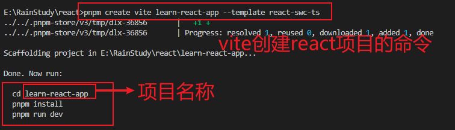

# React 项目

## React 项目创建

1. 使用`Vite`创建项目步骤：
   vite 提供了 4 中 react 模板，即 react，react-ts，react-swc，react-swc-ts

   - React(JavaScript)：创建一个标准的 React 项目，使用 JavaScript 作为开发语言。适用于不需要 TS 类型支持的项目。.jsx 文件用于包含 JSX 代码。
   - react-ts：使用 TS 作为开发语言创建 React 项目。.tsx 文件用于包含 JSX 代码，并且已经配置好了 TS 的编译器选项。
   - react-swc：SWC 是一个超快的编译器，类似于 Babel 但它是用 Rust 编写的，旨在极大提高构建和编译速度。创建一个 React 项目时，选择 SWC 版本意味着 JavaScript/TypeScript 的转译和打包将由 SWC 处理，而不是 TypeScript 原生的编译器或者 Babel。这可以为大型项目带来显著的构建性能提升。
   - react-swc-ts：集成了 react-ts 与 react-swc

```cmd
** 选择 react-swc-ts 作为创建项目的模板，命令如下：
命令中 `learn-react-app` 是项目的名称

npm init vite@latest learn-react-app --template react-swc-ts

# 或者如果您使用Yarn:
yarn create vite learn-react-app --template react-swc-ts

# 或者使用 PNPM:
pnpm create vite learn-react-app --template react-swc-ts

```



## 相关依赖项介绍

```cmd
npm install customize-cra --save-dev

```

1. `customize-cra`：配置和扩展 React 项目中的 Webpack 配置
   使用： 根目录下创建 `config-overrides.js`文件。在其中自定义添加需要的 Webpack 配置。如 添加路径别名
   ```js
   const { override, addWebpackAlias } = require("customize-cra");
   const path = require("path");
   module.exports = override(
     addWebpackAlias({
       "@": path.resolve(__dirname, "src"),
     })
   );
   ```
2. `babel-plugin-import`：是一个 Babel 插件，用于按需加载组件库的模块，以减少打包后的文件体积。(即 按需引入组件库中的需要的组件，而不是整个组件库)
3. `react-app-rewired`：用于修改 Webpack 配置。
   使用：根目录下创建配置文件[config.overrides.js]
   ```js
   // config-overrides.js
   module.exports = function override(config, env) {
     // 修改配置
     return config;
   };
   ```
4. husky / lint-staged / prettier 【百度用法】

## React-Redux

`react-redux` 提供一些高效的方法将 `Redux store`连接到 React 组件。

**优点：**
(1) `React-Redux`提供了清晰且一致的方式来管理和访问应用的状态，避免手动传递 props 的繁琐过程。
(2) 性能优化。`connect`提供了性能优化，可以避免不必要的重新渲染。只有当相关的 state 发生变化时，才会重新渲染。
(3) 易于测试。Redux 的 action 和 reducer 是纯函数，易于编写和测试。而 React-Redux 使得测试容器组件也变得简单。

**使用场景：**

- 需要在多个组件之间共享状态。
- 需要一个可预测的状态管理方案。
- 应用状态逻辑复杂，单纯使用 React 的内部 state 难以管理。

---

- `Provider`：一个高阶组件，让整个应用可以访问 `Redux store`

```jsx
import { Provider } from "react-redux";
import { createStore } from "redux";
import rootReducer from "./reducers";
import App from "./App";

const store = createStore(rootReducer);

ReactDOM.render(
  <Provider store={store}>
    <App />
  </Provider>,
  document.getElementById("root")
);
```

- `connect`：高阶组件，将 React 组件连接到 `Redux store`。
  接收两个参数：(1) `mapStateToProps`函数将 `Redux store`中的 state 映射到组件的 props；(2) `mapDispatchToProps`函数将 dispatch 映射到组件的 props，允许组件发起 actions。

```jsx
import { connect } from "react-redux";

const mapStateToProps = (state) => ({
  counter: state.counter,
});

const mapDispatchToProps = (dispatch) => ({
  increment: () => dispatch({ type: "INCREMENT" }),
  decrement: () => dispatch({ type: "DECREMENT" }),
});

const Counter = ({ counter, increment, decrement }) => (
  <div>
    <h1>{counter}</h1>
    <button onClick={increment}>+</button>
    <button onClick={decrement}>-</button>
  </div>
);

export default connect(mapStateToProps, mapDispatchToProps)(Counter);
```

## prop-types

    是React官方提供的用于类型检查的库，帮助开发者在运行时对组件的props进行类型验证。确保组件接收到的props符合预期的类型，从而减少潜在的错误和bug。

## react-router-dom

- **Link**：用于创建导航链接的组件，类似于 HTML 的`<a>`标签，但它不会引起页面刷新。用于在应用中创建内部链接，以实现客户端路由。
- **withRouter**：高阶组件，用于将路由相关的属性注入到组件中，使非路由组件也能够访问路由信息。通常用于需要访问路由信息但本身不是路由组件的地方。

```jsx
// 实例：
import React from "react";
import { Link, withRouter } from "react-router-dom";

class Navigation extends React.Component {
  render() {
    const { location } = this.props;
    return (
      <nav>
        <ul>
          <li>
            <Link to="/">Home</Link>
          </li>
          <li>
            <Link to="/about">About</Link>
          </li>
          <li>
            <Link to="/contact">Contact</Link>
          </li>
        </ul>
        <p>Current path: {location.pathname}</p>
      </nav>
    );
  }
}

export default withRouter(Navigation);
```

**！**在 React Router v6 中，withRouter 已经被移除了，并且被称为“hooks”来替代。如果你使用的是 React Router v6 版本，那么应该使用 useParams、useLocation、useNavigate 等 hooks 来获取路由相关的信息。

```js
import { useParams, useLocation, useNavigate } from "react-router-dom";

function MyComponent() {
  // 获取路由参数
  const params = useParams();

  // 获取当前路由位置信息
  const location = useLocation();

  // 获取导航函数
  const navigate = useNavigate();

  // 在组件中使用路由参数、位置信息和导航函数
  return (
    <div>
      <p>Route params: {JSON.stringify(params)}</p>
      <p>Location: {JSON.stringify(location)}</p>
      <button onClick={() => navigate("/other-page")}>Go to other page</button>
    </div>
  );
}
```
