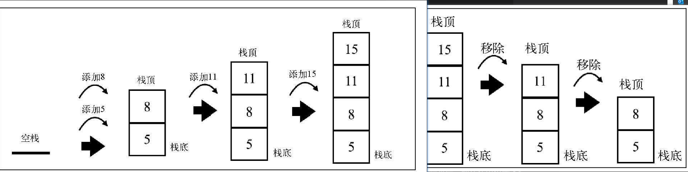

# 栈

## 基本使用

遵循 "先进后出" 原则

```js
# 初始化 Stack类 来表示栈
// 创建一个Stack类来表示栈
class Stack {
    constructor() {
        this.items = []
    }
    //  栈顶即栈尾添加元素
    push(element){
        this.items.push(element)
    }
    pop() {
        return this.items.pop()
    }
    peek() {
        return this.items[this.items.length - 1]
    }
    isEmpty() {
        return this.items.length === 0
    }
    size() {
        return this.items.length
    }
    clear() {
        this.items = []
    }
}
const stack = new Stack()
console.log(`output->stack.isEmpty()`, stack.isEmpty())  // true
stack.push(5)
stack.push(8)
console.log(`output->stack.peek()`, stack.peek())   // 8

stack.push(11)
console.log(`output->stack.size()`, stack.size())  // 3
console.log(`output->stack.isEmpty()`, stack.isEmpty())  // false

stack.push(15)
stack.pop()
stack.pop()
console.log(`output->stack.size()`, stack.size())  // 2
```

如图演示： 
