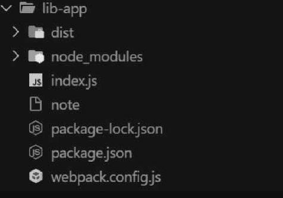
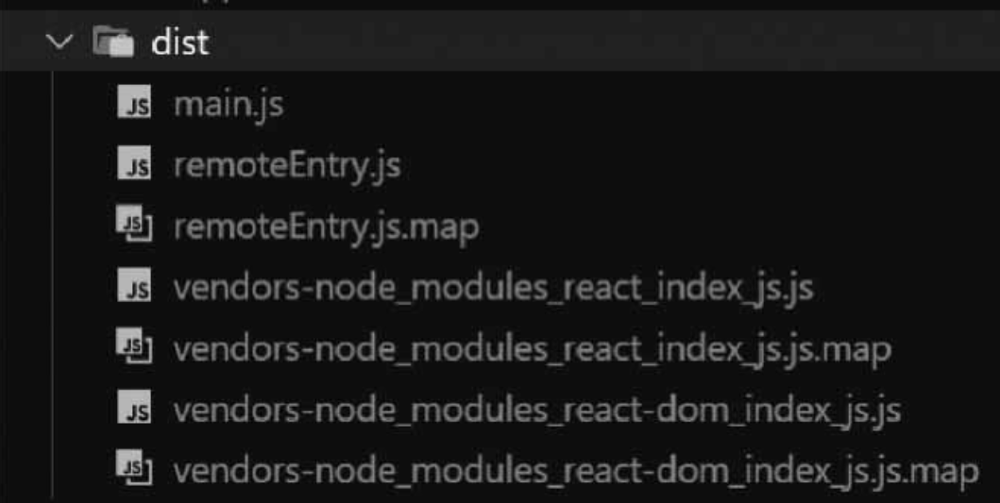
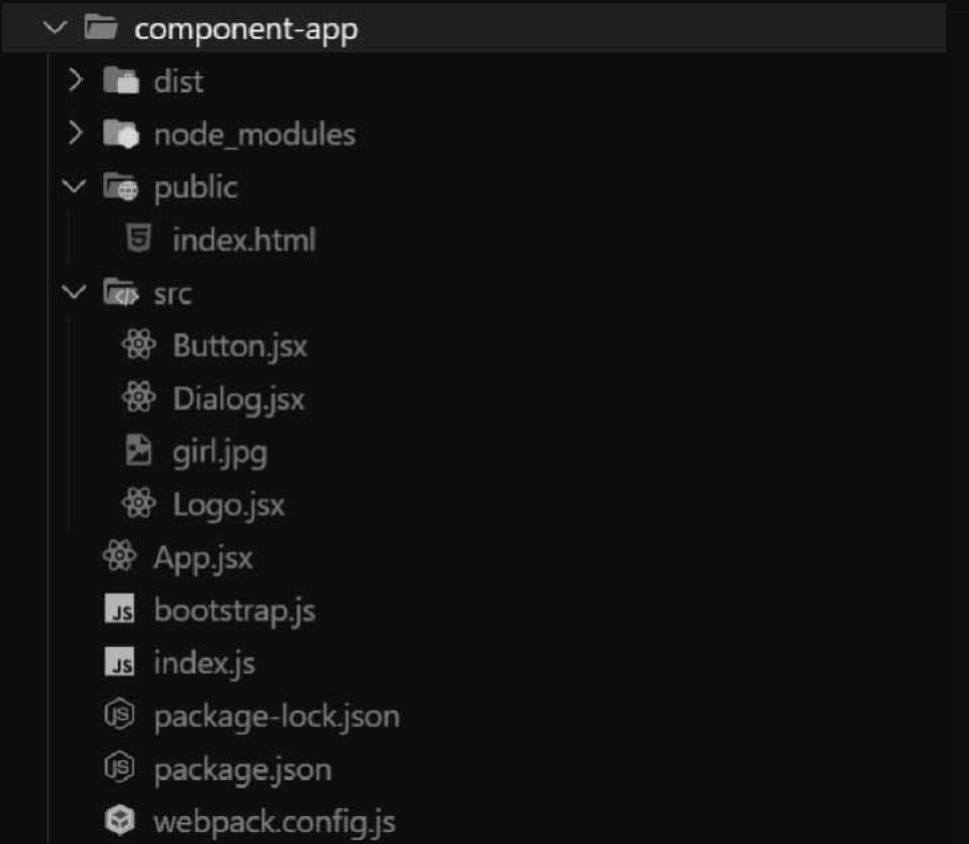

# Webpack 基础

## 核心概念

1. Entry: 入口文件，Webpack 会从该文件开始进行分析与编译。
2. Output：出口路径，打包后创建包的文件路径及文件名。
3. Module：木块，在 Webpack 中任何文件都可以作为一个模块，会根据配置使用不同的 Loader 进行加载和打包。
4. Chunk：代码块，可以根据配置将所有模块代码合并成一个或多个代码块，以便按需加载，提高性能。
5. Loader：模块加载器，进行各种文件类型的加载与转换。通过不同的 Loader,Webpack 有能力调用外部的脚本或工具，实现对不同格式文件的处理，例如分析及将 scss 转换为 css，或者把 ES6+文件转换为现代浏览器兼容的 JS 文件，对 React 的开发而言，合适的 Loader 可以把 React 中用到的 JSX 文件转换为 JS 文件。
6. Plugin：拓展插件，可以通过 Webpack 相应的事件钩子，介入打包过程中的任意环节，从而对代码按需修改。

### 常见加载器（Loader）

Webpack 仅仅提供了打包功能和一套文件处理机制，然后通过生态中的各种 Loader 和 Plugin 对代码进行预编译和打包。

1. Loader 的作用：
   1. Loader 让 Webpack 能够处理那些非 JavaScript 文件。
   2. Loader 专注实现资源模块加载从而实现模块的打包。
2. 常用三类加载器：
   1. 编译转换类：将资源模块转换为 JS 代码。以 JS 形式工作的模块，如 css-loader。
   2. 文件操作类：将资源模块复制到输出目录，同时将文件的访问路径向外导出，如 file-loader。
   3. 代码检查类：对加载的资源文件（一般是代码进行校验，以便统一代码风格，提高代码质量，一般不会修改生产环境的代码。

\* 加载器：解析 ES6+、处理 JSX、CSS/Less/sass 样式、图片与字体。

3. 解析 ES6+
   在 Webpack 中解析 ES6 需要使用 Babel，Babel 是一个 JavaScript 编译器，可以实现将 ES6+转换成浏览器能够识别的代码。
   babel-loader 官网： [https://babel.docschina.org/]

   1. Webpack 中使用 Babel:

   ```js
   # 安装依赖命令：
     npm i @babel/sore @babel/preset - env babel - loader -D
     yarn add -D babel-loader @babel/core @babel/preset-env

   # webpack.config.js文件的Loader配置
     module: {
        rules: [
        {
            test: /\.js$/,              //匹配js文件，交给loader处理
            exclude: /node_modules/,    //排除制定目录不处理
            use: 'babel-loader'
        }
    ]
   }
   ```

   - 在项目根目录创建 babel.config.js 文件，进行配置：

   ```js
   <!-- 配置，使得babel-loader可以找到preset -->
   module.exports = {
    presets: ['@babel/preset-env']
   }
   ```

   - 一共要安装 3 个功能包
     - babel-loader
     - @babel/core 是内部依赖
     - @babel/preset-env 是许多常用 plugin 的集合
     - @符号就是普通名字组成部分而已
   - babel-loader 找到 preset 的 3 种方式 - webpack.config.js 配置文件 - babelrc 配置文件 - babel.config.js 配置文件【推荐】使用

**注意：**
Babel 默认只转换新的 JavaScript 句法(syntax)，而不转换新的 API，例如 Iterator、Generator、Set、Maps、Proxy、Reflect、Symbol、Promise 等全局对象，以及一些定义在全局对象上的方法（例如 Obecj.assign）都不会转码。
转译新的 API，需要借助 polyfill 方案去解决，可使用@babel/polyfill 或@babel/plugin-transform-runtime，二选一即可。

4.  babel/polyfill
    本质上@babel/polyfill 是 core-js 的别名，在 Babel7.4.0 版本中，已经废弃 `@babel/polyfill`，并建议使用 `core-js/stable` 和 `regenerator-runtime/runtime`来替代。

    1. 使用 `core-js/stable` 和 `regenerator-runtime/runtime`方式：

    ```js
    # 安装依赖：
      npm install --save core-js regenerator-runtime

    # 然后在JavaScript代码的入口文件中导入需要的 polyfill：
      import 'core-js/stable';
      import 'regenerator-runtime/runtime'

    <!-- 这样就可以使用 `core-js/stable` 提供的 polyfill 来填充 ECMAScript 新特性，并使用  `regenerator-runtime` 来支持 async/await 等异步特性。 -->
    ```

5.  解析 React JSX
    JSX 是 React 框架中引入的一种 JavaScript XML 扩展语法，它能够支持在 JS 中编写类似 HTML 的标签，本质上来讲 JSX 就是 JS，所以需要 Babel 和 JSX 的插件 preset-react 支持解析。
    安装 React 及@babel/preset-react，命令如下：

    ```cmd
       npm i react-dom @babel/preset-react -D
    ```

    配置解析 React 的 presets

    ```js
    # babel.config.js：
      module.exports = {
         presets: [
         '@babel/preset-env',    //使用 @babel/preset-env 处理 JavaScript
         '@babel/preset-react'   //使用 @babel/preset处理 React JSX
         ]
     }

     # .babelrc 文件
       {
         "presets": [
            "@babel/preset-env",
            "@babel/preset-react"
         ]
       }

     # webpack.config.js 文件中进行配置
       module.exports = {
         entry: { },
         output: {
             path: path.resolve(__dirname, 'dist'),  //输出目录
             filename: 'bundle.js'       //输出文件名
          },
         resolve: {
             // 要解析的文件的扩展名
             extensions: [".js", ".jsx",".json"]，
             // 解析目录时要使用的文件名
             mainFiles: ["index"],
         },
         module: {
             rules: [
                 {
                     test: /\.(js|jsx)$/,                 // 匹配所有以 .js 或 .jsx 结尾的文件
                     exclude: /(node_modules|bower_components)/,  //排除 node_modules 和 bower_components 目录下的文件
                     use: {
                         loader: 'babel-loader',      // 使用 babel-loader 处理 JavaScript 文件
                         options: {
                             presets: ['@babel/preset-env','@babel/preset-react']
                         }
                     }
                 }
             ]
         }
       }
    ```

6.  解析 CSS

    1. CSS
       1. css-loader：用于加载.css 文件并转换 commonJS 对象。
       2. style-loader：将样式通过 style 标签插入 head 中。

    - 安装依赖 css-loader 和 style-loader 命令

    ```cmd
     npm i style-loader css-loader -D
     yarn add -D css-loader style-loader
    ```

    - 在 webpack.config.js 中 loader 配置

    ```js
    module.exports = {
      // 给webpack配置各种loader
      module: {
        rules: [
          {
            //css的loader配置
            test: /\.css$/,
            use: ["style-loader", "css-loader"],
          },
        ],
      },
    };
    ```

    2. `.less`文件转换成`.css`文件
       1. 确保已经安装 `less` 和 `less-loader`：
       ```cmd
         npm install less less-loader --save-dev
         yarn add less less-loader --dev
       ```

    - 在 webpack 配置文件中添加 less-loader 的规则:

    ```js
    module.exports = {
      // 给webpack配置各种loader
      module: {
        rules: [
          {
            // css的loader配置
            test: /\.css$/,
            use: ["style-loader", "css-loader"],
          },
          {
            // less的loader配置
            test: /\.less$/,
            use: [
              "style-loader", //将解析后的css代码通过<style>标签插入到HTML页面中
              "css-loader", //解析css文件
              "less-loader", //将less文件编译成 css文件
            ],
          },
        ],
      },
    };
    ```

7.  解析图片和字体
    Webpack 提供了两个 loader 处理二进制格式的文件，如 图片和字体等，url-loader 允许有条件地将文件转换为内联的 base-64 URL(当文件小于给定的阈值时)，这会减少小文件的 HTTP 请求数。如果文件大于该阈值，则会自动交给 file-loader 处理。

    1. file-loader
       file-loader 用于处理文件及字体。安装 file-loader 依赖并配置：

    ```js
     # 安装file-loader
       npm i file-loader -D
     # webpack.config.js 配置
        rules: [{
         test: /\.(png|svg|jpg|gif)$/,
         use: 'file-loader' // 处理图片文件
       },
       {
         test: /\.(woff|woff2|eot|ttf|otf|svg)$/,
         use: 'file-loader' // 处理字体文件
       }]
    ```

    2. url-loader
       url-loader 可以处理文件及字体，对比 file-loader 的优势是可以通过配置，将小资源自动转换为 base64。
       安装 url-loader 依赖并配置 Webpack:

    ```js
     # 安装 url-loader 和 file-loader 依赖
       npm install url-loader file-loader --save-dev
     # webpack.config.js 配置
       rules: [
       {
         test: /\.(png|jpg|gif|svg)$/, // 匹配图片文件
         use: [
           {
             loader: 'url-loader', // 使用 url-loader 处理图片文件
             options: {
               limit: 8192, // 小于 8KB 的图片会被转为 base64 格式
               name: 'images/[name].[hash:7].[ext]' // 输出文件名格式
             }
           }
         ]
       },
       {
         test: /\.(woff|woff2|eot|ttf|otf)$/, // 匹配字体文件
         use: [
           {
             loader: 'url-loader', // 使用 url-loader 处理字体文件
             options: {
               limit: 8192, // 小于 8KB 的字体文件会被转为 base64 格式
               name: 'fonts/[name].[hash:7].[ext]' // 输出文件名格式
             }
           }
         ]
       }
     ]
    ```

8.  插件（Plugin）
    插件的目的是为了增强 Webpack 的自动化能力，Plugin 可解决其他自动化工作，如 清除 dist 目录、将静态文件复制至输出代码、压缩输出代码，常见场景：

    1. 实现自动在打包之前清除 dist 目录（上次的打包结果）。
    2. 自动生成应用所需要的 HTML 文件。
    3. 根据不同环境为代码注入类似 API 地址这种可能变化的部分。
    4. 将不需要参与打包的资源文件复制到输出目录。
    5. 压缩 Webpack 打包完成后输出的文件。
    6. 自动将打包结果发布到服务器以实现自动部署。

9.  文件指纹
    文件指纹的作用：

    1. 在前端发布体系中，为了实现增量发布，一般会对静态资源加上 md5 文件后缀，保证每次发布的文件都没有缓存，同时对于未修改的文件不会受发布的影响，最大限度地利用缓存。
    2. “文件指纹”的应用是在项目打包时使用(上线)，在项目开发阶段用不到。

    3 种不同的 hash 表示方式：

    1. hash：与整个项目的构建相关，当有文件修改时，整个项目构建的 hash 值就会更新。
    2. chunkhash：和 Webpack 打包的 chunk 相关，不同的 entry 会生成不同的 chunkhash，一般用于.js 文件的打包。
    3. contenthash：根据文件内容来定义 hash，如果文件内容不变，则 contenthash 不变。如.css 文件的打包，当修改了.js 或 html 文件但没有修改引入的.css 样式时，文件不需要生成新的 hash 值，所以可适用于.css 文件的打包。

    \* 注意： 文件指纹不能和热更新一起使用

    - .js 文件指纹设置： chunkhash

    ```js
    # webpack.dev.js
      module.export = {
         entry: {
             index: './src/demo.js',
             search: './src/search.js'
         },
         output: {
             path: path.resolve(__dirname, 'dist'),
             filename: '[name].[chunkhash:8].js'
         }
      }
    ```

    - .css 文件指纹：contenthash
      由于上面方式通过 style 标签将 css 插入 head 中并没有生成单独的.css 文件，因此可以通过 min-css-extract-plugin 插件将 css 提取单独的.css 文件，并添加文件指纹。
      安装依赖 mini-css-extract-plugin 命令：

      ```js
      # 安装命令：
         npm i mini-css-extract-plugin -D
      # 配置.css文件指纹配置
         const MiniCssExtractPlugin = require('mini-css-extract-plugin')
         module.exports = {
             module: {
                 rules: [
                     {
                         test: /\.css$/,
                         use: [
                             MiniCssExtractPlugin.loader,
                             'css-loader'
                         ]
                     }
                 ]
             },
             plugins: [
                 new MiniCssExtractPlugin({
                     filename: '[name].[contenthash:8].css'
                 })
             ]
         }
      ```

    - 图片文件指纹设置： hash
      hash 对应的是文件内容的 hash 值，默认由 md5 生成，配置：
      ```js
      module.exports = {
        module: {
          rules: [
            {
              test: /\.(png|svg|jpg|jpeg|gif)$/,
              use: [
                {
                  loader: "file-loader",
                  options: {
                    name: "img/[name].[hash:8].[ext]",
                  },
                },
              ],
            },
          ],
        },
      };
      ```
    - 代码压缩：.css 文件压缩和.html 文件压缩。

      1. .css 文件压缩： optimize-css-assets-webpack-plugin

         ```js
         # 安装optimize-css-assets-webpack-plugin和预处理器cssnano 命令：
            npm i optimize-css-assets-webpack-plugin cssnano -D
         # 配置Webpack
            const OptimizeCssAssetsPlugin = require('optimize-css-assets-webpack-plugin')
            module.exports = {
             plugins: [
                 new OptimizeCssAssetsPlugin({
                     assetNameRegExp: /\.css$/g,   // 匹配所有的 CSS 文件名
                     cssProcessor: require('cssnano')   // 使用 cssnano 进行 CSS 压缩
                 })
             ]
            }
         ```

      2. .html 文件压缩：html-webpack-plugin

      ```js
       # 安装 html-webpack-plugin插件，命令：
           npm i html-webpack-plugin -D
       # 配置Webpack
           const path = require('path');
           const HtmlWebpackPlugin = require('html-webpack-plugin')
           module.exports = {
             plugins: [
                 new HtmlWebpackPlugin({
                     template: path.join(__dirname, 'src/search.html'),   //使用模板
                     filename: 'search.html',        //打包后的文件名
                     chunks: ['search'],    //打包后需要使用的chunk（文件）
                     inject: true,       //默认注入所有静态资源
                     minify: {
                         html5: true,
                         collapsableWhitespace: true,
                         preserveLineBreaks: false,
                         minifyCSS: true,
                         minifyJS: true,
                         removeComments: false
                     }
                 })
             ]
           }
      ```

10. 跨应用代码共享(Module Federation)
    Module Federation 使 JavaScript 应用得以在客户端或服务器上动态运行另一个包的代码。Module Federation 主要用来解决多个应用之间代码共享的问题，可以更加优雅地实现应用的代码共享。

    1. 三个概念：

       | 模块名称 | 说明                                               |
       | -------- | -------------------------------------------------- |
       | webpack  | 一个独立项目通过 Webpack 打包编译而产生资源包      |
       | remote   | 一个暴露模块供其他 Webpack 构建消费的 Webpack 构建 |
       | host     | 一个消费其他 remote 模块的 Webpack 构建            |

       一个 Webpack 构建可以是 remote(服务的提供方)，也可以是 host(服务的消费方)，还可以同时扮演服务提供者和服务消费者的角色，这完全看项目的架构。

    2. host 与 remote 两个角色的依赖关系
       任何一个 Webpack 构建既可以作为 host 消费方，也可以作为 remote 提供方，区别在于职责和 Webpack 配置的不同。
    3. 案列讲解
       一共有三个微应用： lib-app、component-app、main-app,角色分别如表：
       | 模块名称 | 属性描述 |
       | -------- | -------------------------------------------------- |
       | lib-app | 作为 remote，暴露了两个模块 react 和 react-dom |
       | component-app | 作为 remote 和 host，依赖 lib-app 暴露了一些组件供 main-app 消费 |
       | main-app | 作为 host，依赖 lib-app 和 component-app |
       分别创建三个微应用项目：
       lib-app 模块提供其他模块所依赖的核心库，如 lib-app 对外提供 react 和 react-dom 两个类库模块。

       步骤 1：创建 lib-app 模块项目，目录结构：

       ```cmd
       # 安装核心模块
         npm i react react-dom -S
       # 安装开发依赖模块
         npm install concurrently serve webpack webpack-cli -D
       ```

       

       ModuleFederationPlugin 插件相关属性
       | 属性名称 | 属性描述 |
       | -------- | -------------------------------------------------- |
       | name | 必选，唯一 ID，作为输出的模块名，使用时通过${name}/${expose}的方式使用 |
       | library | 必选，这里的 library.name 作为 umd 的 library.name |
       | remotes | 可选，表示作为 host 时，去消费哪些 remote |
       | shared | 可选，优先用 host 的依赖，如果 host 没有，则再用自己的 |

       步骤 2： 配置 Webpack 编译配置：

       ```js
       const { ModuleFederationPlugin } = require("webpack").container;
       const path = require("path");
       module.exports = {
         entry: "./index.js",
         mode: "development",
         devtool: "hidden-source-map",
         output: {
           publicPath: "http://localhost:3000/",
           clean: true,
         },
         module: {},
         plugins: [
           new ModuleFederationPlugin({
             name: "lib_app",
             filename: "remoteEntry.js",
             exposes: {
               "./react": "react",
               "./react-dom": "react-dom",
             },
           }),
         ],
       };
       ```

       步骤 3：配置 package.json 文件中的运行脚本：

       ```js
        "scripts": {
            "webpack": "webpack --watch",
            "serve": "serve fist -p 3000",
            "start": "concurrently\"npm run webpack\"\"npm run serve\""
        }
       ```

       步骤 4：除去生成的 map 文件，输出具体的编译文件如下：

       ```
          main.js
          remoteEntry.js
          react_index.js
          react-dom_index.js
       ```

       步骤 5：在命令行中，输入 npm serve 命令启动 lib-app 项目，启动后在 3000 端口浏览。 http://localhost:3000/

       component-app 模块对外提供组件库，如 Button、Dialog、Logo 基础组件
       步骤 1：创建 component-app 模块，目录结构：
       
       lib-app 模块打包输出目录：
       

11. 开发运行构建
    使用 Webpack 的 Webpack-dev-server 插件可以帮助开发者快速搭建一个代码运行环境，Webpack-dev-server 提供的热更新功能极大地方便了代码编译后进行预留。

        1. 文件监听：watch
           在 Webpack-cli 中提供 watch 工作模式，这种模式下项目中的文件会被监视，一旦这些文件发生变化就会自动重新运行打包任务。
           Webpack 开启监听模式两种方式：
           (1) 启动 Webpack 命令时带上 --watch 参数。
           (2) 在配置 webpack.config.js 文件中设置 watch:true。
           缺点：每次需要手动刷新浏览器更新。

        Webpack-dev-server 构建的内容会存放在内存中，构建速度更快，并且可自动地实现浏览器的自动识别并做出变化，需要配置 Webpack 内置的 HotModuleReplacementPlugin 插件一起使用。
        安装依赖并配置启动项：

    ```js
        # 安装
            npm i webpack-dev-server -D
          //package.json
          "scripts": {
             dev: "webpack-dev-server --open"
         }
    ```

    ```js
        // 配置webpack
        const path = require('path');
        const HtmlWebpackPlugin = require('html-webpack-plugin');
        module.exports = {
            mode: 'development', // 设置为开发模式
            entry: './src/index.js', // 入口文件
            output: {
                path: path.resolve(**dirname, 'dist'), // 输出目录
                filename: 'bundle.js' // 输出文件名
                },
                devServer: {
                    contentBase: path.join(**dirname, 'dist'), // 告诉服务器从哪个目录中提供内容
                    compress: true, // 是否启用 gzip 压缩
                    port: 3006 // 服务器端口
                },
                plugins: [
                    new HtmlWebpackPlugin({
                        template: path.join(__dirname, 'src/index.html'), // HTML 模板文件
                        filename: 'index.html' // 输出的 HTML 文件名
                        })
                    ]
            };
    ```

        2. 清理构建目录： clean-webpack-plugin
        默认会执行删除output值的输出目录。
        安装clean-webpack-plugin插件并配置：

        ```js
          # 安装
            npm i clean-webpack-plugin -D
        // webpack.config.js文件配置：
           const { CleanWebpackPlugin } = require('clean-webpack-plugin')
           module.exports = {
            plugins: [
                new CleanWebpackPlugin()
            ]
           }
        ```

## Webpack 进阶

可以通过 Webpack 插件进行打包内容分析，优化编译速度，减少构建包体积，同时通过接口编写自己的 Loader 和 Plugin 插件。

## 1. 项目分析

      通过Webpack-bundle-analyzer可以看到项目各模块的大小，对各模块可以按需优化。
      该插件通过读取输出文件夹（通常 dist）中的stats.json文件，把该文件可视化展现。便于直观地比较各个包文件的大小，以达到优化性能的目的。

      ```js
       # 安装命令：
         npm install --save-dev webpack-bundle-analyzer
       // webpack.config.js 配置
         const path = require('path')
         var BundleAnalyzerPlugin = require('webpack-bundle-analyzer').BundleAnalyzerPlugin
         module.exports = {
            mode: "development",
            entry: "./src/main/js",
            output: {
                filename: "bundle.js",
                path: path.reaolve(__dirname, "dist")
            },
            plugins: [
                new BundleAnalyzerPlugin()
            ]
         }
      ```

## 2. 编译阶段提速

      1. IgnorePlugin: 忽略第三方包指定目录
